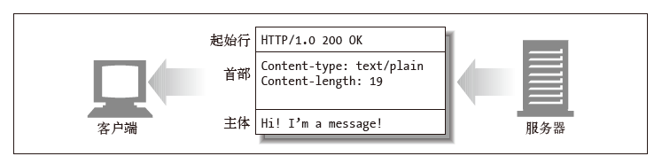

#### 报文流

HTTP 报文是在HTTP 应用程序之间发送的数据块. 这些数据块以一些文本形式的元信息(meta-information)开头, 这些信息描述了报文的内容及含义, 后面跟着可选的数据部分..

#### 报文的组成部分

每条报文都包含一条来自客户端的请求, 或者一条来自服务器的响应. 它们由三个部分组成: 对报文进行描述的起始行(start line)、 包含属性的首部(header)块, 以及可选的、 包含数据的主体(body)部分.



起始行和首部就是由行分隔的ASCII 文本. 每行都以一个由两个字符组成的行终止序列作为结束, 其中包括一个回车符(ASCII 码13)和一个换行符(ASCII 码10)这个行终止序列可以写做CRLF. 需要指出的是, 尽管HTTP 规范中说明应该用CRLF 来表示行终止, 但稳健的应用程序也应该接受单个换行符作为行的终止. 有些老的, 或不完整的HTTP 应用程序并不总是既发送回车符, 又发送换行符.

实体的主体或报文的主体(或者就称为主体)是一个可选的数据块. 与起始行和首部不同的是, 主体中可以包含文本或二进制数据, 也可以为空.

这是请求报文的格式:

```
<method> <request-URL> <version>
<headers>
<entity-body>
```

这是响应报文的格式(注意, 只有起始行的语法有所不同):

```
<version> <status> <reason-phrase>
<headers>
<entity-body>
```

* 方法(method): 客户端希望服务器对资源执行的动作. 是一个单独的词, 比如`GET`、  `HEAD` 或`POST`. 本章稍后将详细介绍方法.
* 请求URL(request-URL): 命名了所请求资源, 或者 URL 路径组件的完整 URL . 如果直接与服务器进行对话, 只要 URL 的路径组件是资源的绝对路径, 通常就不会有什么问题——服务器可以假定自己是 URL 的主机/ 端口.
* 版本(version)报文所使用的HTTP 版本, 其格式看起来是这样的:`HTTP/<major>.<minor>`.
* 状态码(status-code): 这三位数字描述了请求过程中所发生的情况. 每个状态码的第一位数字都用于描述状态的一般类别("成功"、 "出错"等). 本章稍后提供了 HTTP 规范定义的状态码及其含义的完整列表.
* 原因短语(reason-phrase): 数字状态码的可读版本, 包含行终止序列之前的所有文本. 本章稍后提供了 HTTP 规范定义的所有状态码的原因短语示例. 原因短语只对人类有意义, 因此, 比如说, 尽管响应行`HTTP/1.0 200 NOT OK` 和 `HTTP/1.0 200 OK` 中原因短语的含义不同, 但同样都会被当作成功指示处理.
* 首部(header): 可以有零个或多个首部, 每个首部都包含一个名字, 后面跟着一个冒号(`:`), 然后是一个可选的空格, 接着是一个值, 最后是一个CRLF. 首部是由一个空行(CRLF)结束的, 表示了首部列表的结束和实体主体部分的开始. 有些 HTTP 版本, 比如 HTTP/1.1, 要求有效的请求或响应报文中必须包含特定的首部. 

##### 起始行

###### 请求行

请求报文请求服务器对资源进行一些操作. 请求报文的起始行, 或称为请求行, 包含了一个方法和一个请求 URL, 这个方法描述了服务器应该执行的操作, 请求 URL 描述了要对哪个资源执行这个方法. 请求行中还包含 HTTP 的版本, 用来告知服务器, 客户端使用的是哪种HTTP. 所有这些字段都由空格符分隔.

###### 响应行

响应报文承载了状态信息和操作产生的所有结果数据, 将其返回给客户端. 响应报文的起始行, 或称为响应行, 包含了响应报文使用的HTTP 版本、 数字状态码, 以及描述操作状态的文本形式的原因短语.

###### 方法

请求的起始行以方法作为开始, 方法用来告知服务器要做些什么.

方法|描述|是否包含主体
-----|-----|-----
GET| 从服务器获取一份文档|否
HEAD| 只从服务器获取文档的首部|否
POST| 向服务器发送需要处理的数据|是
PUT| 将请求的主体部分存储在服务器上|是
TRACE| 对可能经过代理服务器传送到服务器上去的报文进行追踪|否
OPTIONS| 决定可以在服务器上执行哪些方法|否
DELETE| 从服务器上删除一份文档|否

###### 状态码

状态码用来告诉客户端, 发生了什么事情.

状态码是在每条响应报文的起始行中返回的. 会返回一个数字状态和一个可读的状态. 数字码便于程序进行差错处理, 而原因短语则更便于人们理解.

可以通过三位数字代码对不同状态码进行分类:
200 到299 之间的状态码表示成功.
300 到399 之间的代码表示资源已经被移走了.
400 到499 之间的代码表示客户端的请求出错了.
500 到599 之间的代码表示服务器出错了.

title|title|title
-----|-----|-----
100 ～ 199| 100 ～ 101| 信息提示
200 ～ 299| 200 ～ 206| 成功
300 ～ 399| 300 ～ 305| 重定向
400 ～ 499| 400 ～ 415| 客户端错误
500 ～ 599| 500 ～ 505| 服务器错误

###### 原因短语

原因短语是响应起始行中的最后一个组件. 它为状态码提供了文本形式的解释. 比如, 在行 `HTTP/1.0 200 OK` 中, `OK` 就是原因短语.

原因短语和状态码是成对出现的. 原因短语是状态码的可读版本, 应用程序开发者将其传送给用户, 用以说明在请求期间发生了什么情况.

HTTP 规范并没有提供任何硬性规定, 要求原因短语以何种形式出现.

###### 版本号

版本号会以 `HTTP/x.y` 的形式出现在请求和响应报文的起始行中. 为 HTTP 应用程序提供了一种将自己所遵循的协议版本告知对方的方式.

使用版本号的目的是为使用 HTTP 的应用程序提供一种线索, 以便互相了解对方的能力和报文格式. 在与使用 HTTP 1.1 的应用程序进行通信的 HTTP 1.2 应用程序应该知道, 它不能使用任何新的 1.2 特性, 因为使用老版本协议的应用程序很可能无法实现这些特性.

##### 首部

跟在起始行后面的就是零个、 一个或多个HTTP 首部字段.

###### 首部分类

* 通用首部: 既可以出现在请求报文中, 也可以出现在响应报文中.
* 请求首部: 提供更多有关请求的信息.
* 响应首部: 提供更多有关响应的信息.
* 实体首部: 描述主体的长度和内容, 或者资源自身.
* 扩展首部: 规范中没有定义的新首部

每个HTTP 首部都有一种简单的语法: 名字后面跟着冒号( `:` ), 然后跟上可选的空格, 再跟上字段值, 最后是一个CRLF.

##### 实体的主体部分

HTTP 报文的第三部分是可选的实体主体部分. 实体的主体是 HTTP 报文的负荷. 就是HTTP 要传输的内容.

HTTP 报文可以承载很多类型的数字数据: 图片、 视频、 HTML 文档、 软件应用程序、 信用卡事务、 电子邮件等.

#### 方法

HTTP 定义了一组被称为安全方法的方法. `GET` 方法和 `HEAD` 方法都被认为是安全
的, 这就意味着使用 `GET` 或 `HEAD` 方法的 HTTP 请求都不会产生什么动作. 不产生动作, 在这里意味着HTTP 请求不会在服务器上产生什么结果.

安全方法并不一定是什么动作都不执行的.

##### GET

`GET` 是最常用的方法. 通常用于请求服务器发送某个资源.

##### HEAD

`HEAD` 方法与 `GET` 方法的行为很类似, 但服务器在响应中只返回首部. 不会返回实体的主体部分. 这就允许客户端在未获取实际资源的情况下, 对资源的首部进行检查. 使用HEAD, 可以:

* 在不获取资源的情况下了解资源的情况(比如, 判断其类型); 
* 通过查看响应中的状态码, 看看某个对象是否存在; 
* 通过查看首部, 测试资源是否被修改了.

服务器开发者必须确保返回的首部与GET 请求所返回的首部完全相同.

##### PUT

与 `GET` 从服务器读取文档相反, `PUT` 方法会向服务器写入文档.

`PUT` 方法的语义就是让服务器用请求的主体部分来创建一个由所请求的 URL 命名的新文档, 或者, 如果那个 URL 已经存在的话, 就用这个主体来替代它.

因为 `PUT` 允许用户对内容进行修改, 所以很多 Web 服务器都要求在执行 `PUT` 之前, 用密码登录.

##### POST

`POST` 方法起初是用来向服务器输入数据的. 实际上, 通常会用它来支持HTML的表单.

表单中填好的数据通常会被送给服务器, 然后由服务器将其发送到它要去的地方.

##### TRACE

客户端发起一个请求时, 这个请求可能要穿过防火墙、 代理、 网关或其他一些应用程序. 每个中间节点都可能会修改原始的 HTTP 请求. `TRACE` 方法允许客户端在最终将请求发送给服务器时, 看看它变成了什么样子.

##### OPTIONS

`OPTIONS` 方法请求 Web 服务器告知其支持的各种功能. 可以询问服务器通常支持哪些方法, 或者对某些特殊资源支持哪些方法.

##### DELETE

`DELETE` 方法所做的事情就是请服务器删除请求URL 所指定的资源.

#### 状态码

HTTP 状态码被分成了五大类.

##### 100～199——信息性状态码

##### 200～299——成功状态码

客户端发起请求时, 这些请求通常都是成功的. 服务器有一组用来表示成功的状态码, 分别对应于不同类型的请求.

##### 300～399——重定向状态码

重定向状态码要么告知客户端使用替代位置来访问他们所感兴趣的资源, 要么就提供一个替代的响应而不是资源的内容. 如果资源已被移动, 可发送一个重定向状态码和一个可选的Location 首部来告知客户端资源已被移走, 以及现在可以在哪里找到它.. 这样, 浏览器就可以在不打扰使用者的情况下, 透明地转入新的位置了.

##### 400～499——客户端错误状态码

有时客户端会发送一些服务器无法处理的东西, 比如格式错误的请求报文, 或者最常见的是, 请求一个不存在的URL.

常见的 400-499 状态码:
状态码|原因短语|含义
-----|-----|-----
400 | Bad Request | 用于告知客户端它发送了一个错误的请求.
403 | Forbidden | 用于说明请求被服务器拒绝了. 如果服务器想说明为什么拒绝请求, 可以包含实体的主体部分来对原因进行描述. 但这个状态码通常是在服务器不想说明拒绝原因的时候使用的.
404 | Not Found | 用于说明服务器无法找到所请求的URL. 通常会包含一个实体, 以便客户端应用程序显示给用户看.

##### 500～599——服务器错误状态码

有时客户端发送了一条有效请求, 服务器自身却出错了. 这可能是客户端碰上了服务器的缺陷, 或者服务器上的子元素, 比如某个网关资源, 出了错.

#### 首部

首部和方法配合工作, 共同决定了客户端和服务器能做什么事情.

在请求和响应报文中都可以用首部来提供信息, 有些首部是某种报文专用的, 有些首部则更通用一些. 可以将首部分为五个主要的类型.

##### 通用首部

这些是客户端和服务器都可以使用的通用首部. 可以在客户端、 服务器和其他应用程序之间提供一些非常有用的通用功能. 比如, Date 首部就是一个通用首部, 每一端都可以用它来说明构建报文的时间和日期:

```
Date: Tue, 3 Oct 1974 02:16:00 GMT
```

##### 请求首部

请求首部是请求报文特有的. 它们为服务器提供了一些额外信息, 比如客户端希望接收什么类型的数据. 例如 Accept 首部就用来告知服务器客户端会接受与其请求相符的任意媒体类型:

```
Accept: */*
```

##### 响应首部

响应报文有自己的首部集, 以便为客户端提供信息(比如, 客户端在与哪种类型的服务器进行交互). 例如 Server 首部就用来告知客户端它在与一个版本 1.0 的 Tiki-Hut 服务器进行交互:

```
Server: Tiki-Hut/1.0
```

##### 实体首部

实体首部指的是用于应对实体主体部分的首部. 比如, 可以用实体首部来说明实体主体部分的数据类型. 例如, 可以通过下 Content-Type 首部告知应用程序, 数据是以 iso-latin-1 字符集表示的 HTML 文档:

```
Content-Type: text/html; charset=iso-latin-1
```

##### 扩展首部

扩展首部是非标准的首部, 由应用程序开发者创建, 但还未添加到已批准的 HTTP 规范中去. 即使不知道这些扩展首部的含义, HTTP 程序也要接受它们并对其进行转发.
