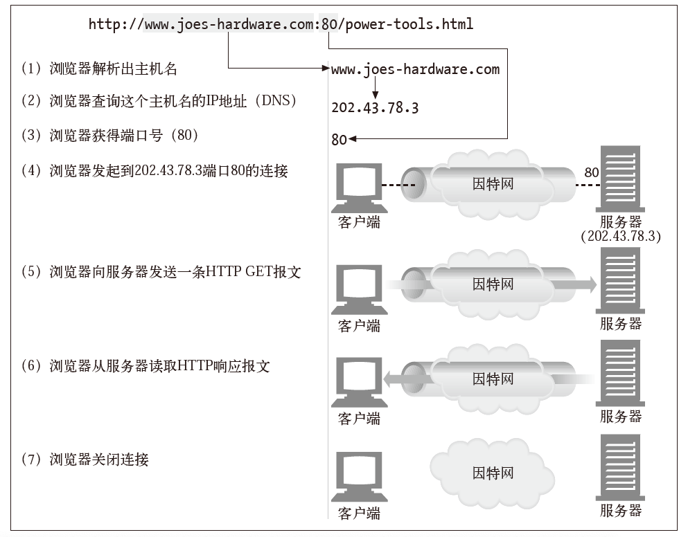
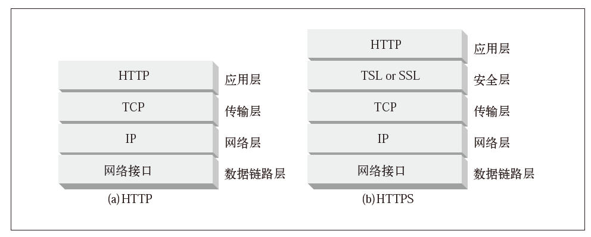
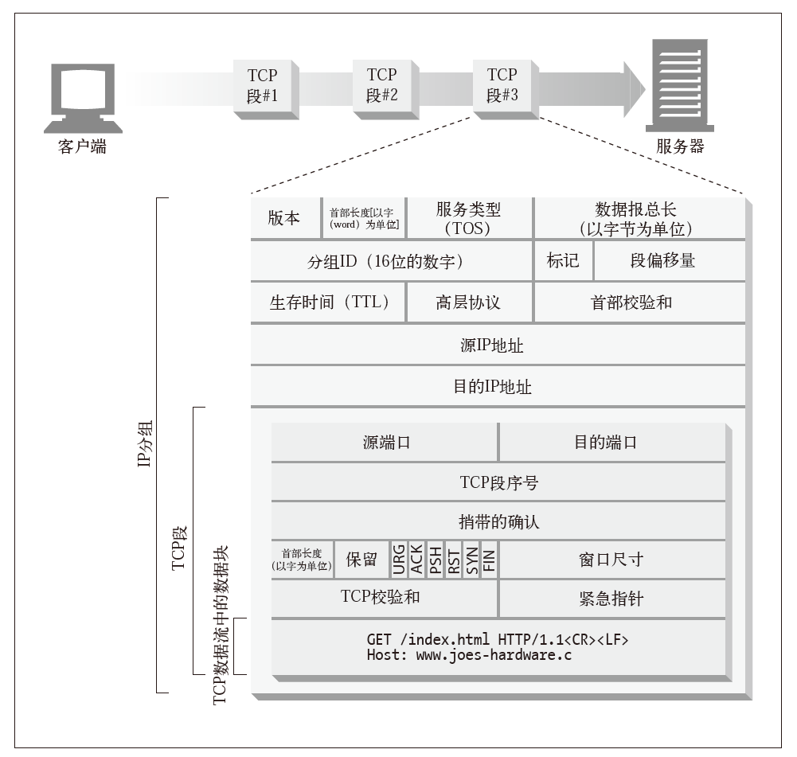
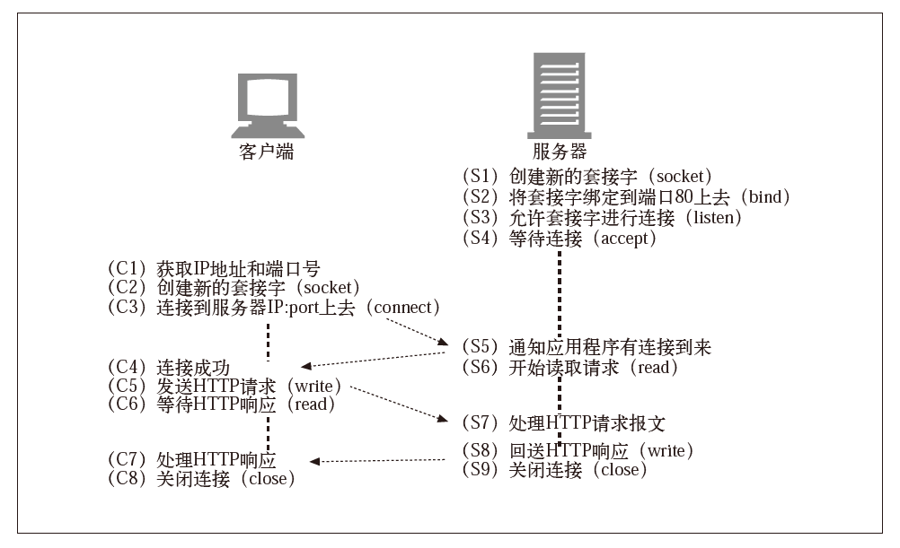

#### TCP 连接



TCP 为 HTTP 提供了一条可靠的比特传输管道. 从TCP 连接一端填入的字节会从另一端以原有的顺序、 正确地传送出来.

TCP 的数据是通过名为IP 分组(或IP 数据报)的小数据块来发送的. 这样的话, HTTP 就是"HTTP over TCP over IP"这个"协议栈"中的最顶层了. 其安全版本HTTPS 就是在 HTTP 和 TCP 之间插入了一个(称为 TLS 或 SSL 的)密码加密层.



HTTP 要传送一条报文时, 会以流的形式将报文数据的内容通过一条打开的 TCP 连接按序传输. TCP 收到数据流之后, 会将数据流砍成被称作段的小数据块, 并将段封装在 IP 分组中, 通过因特网进行传输. 所有这些工作都是由 TCP/IP 软件来处理的, HTTP 程序员什么都看不到.



每个 TCP 段都是由 IP 分组承载, 从一个 IP 地址发送到另一个 IP 地址的. 每个 IP 分组中都包括:

* 一个 IP 分组首部(通常为 20 字节); 
* 一个 TCP 段首部(通常为 20 字节); 
* 一个 TCP 数据块(0 个或多个字节).

IP 首部包含了源和目的IP 地址、 长度和其他一些标记. TCP 段的首部包含了TCP端口号、 TCP 控制标记, 以及用于数据排序和完整性检查的一些数字值.

在任意时刻计算机都可以有几条 TCP 连接处于打开状态. TCP 是通过端口号来保持所有这些连接持续不断地运行.

TCP 连接是通过 4 个值来识别的:

```
< 源 IP 地址、源端口号、目的 IP 地址、目的端口号>
```

这4个值一起唯一地定义了一条连接. 两条不同的 TCP 连接不能拥有4个完全相同的地址组件值. IP 地址可以将你连接到正确的计算机, 而端口号则可以将你连接到正确的应用程序上去.

##### TCP 套接字

套接字API|调用
-----|-----
`s = socket(<parameters>)` | 创建一个新的、 未命名、 未关联的套接字
`bind(s, <local IP:port>)` | 向套接字赋一个本地端口号和接口
`connect(s, <remote IP:port>)` | 创建一条连接本地套接字与远程主机及端口的连接
`listen(s, ...)` | 标识一个本地套接字, 使其可以合法接受连接
`s2 = accept(s)` | 等待某人建立一条到本地端口的连接
`n = read(s, buffer, n)` | 尝试从套接字向缓冲区读取 `n` 个字节
`n = write(s, buffer, n)` | 尝试从缓冲区中向套接字写入 `n` 个字节
`close(s)` | 完全关闭 TCP 连接
`shutdown(s, <side>)` | 只关闭 TCP 连接的输入或输出端
`getsockopt(s, ...)` | 读取某个内部套接字配置选项的值
`setsockopt(s, ...)` | 修改某个内部套接字配置选项的值

这个套接字API向 HTTP 程序员隐藏了 TCP 和 IP 的所有细节. 套接字API 允许用户创建TCP 的端点数据结构, 将这些端点与远程服务器的 TCP 端点进行连接, 并对数据流进行读写. TCP API 隐藏了所有底层网络协议的握手细节, 以及 TCP 数据流与 IP 分组之间的分段和重装细节.



我们从Web 服务器等待连接(参见图上图 S4)开始. 客户端根据 URL 判定出 IP 地址和端口号, 并建立一条到服务器的 TCP 连接(参见图上图 C3). 建立连接可能要花费一些时间, 时间长短取决于服务器距离的远近、 服务器的负载情况, 以及因特网的拥挤程度.

一旦建立了连接, 客户端就会发送HTTP 请求(参见图上图 C5), 服务器则会读取请求(参见图上图 S6). 一旦服务器获取了整条请求报文, 就会对请求进行处理, 执行所请求的动作(参见图上图 S7), 并将数据写回客户端. 客户端读取数据(参见图上图 C6), 并对响应数据进行处理(参见图上图 C7).
