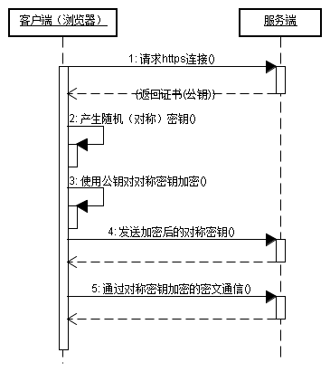

#### 区别

* HTTP 是互联网上应用最为广泛的一种网络协议, 是一个客户端和服务器端请求和应答的标准(TCP), 用于从服务器传输超文本到本地浏览器的传输协议, 它可以使浏览器更加高效.

* HTTPS: 是以安全为目标的 HTTP 通道, 简单讲是 HTTP 的安全版, 即 HTTP 下加入 SSL 层, HTTPS 的安全基础是 SSL, 因此加密的详细内容就需要 SSL . HTTPS 协议的主要作用可以分为两种: 一种是建立一个信息安全通道, 来保证数据传输的安全; 另一种就是确认网站的真实性.

HTTP 协议传输的数据都是==未加密的, 也就是明文的==, 因此使用 HTTP 协议传输隐私信息非常不安全, 为了保证这些隐私数据能加密传输, 于是网景公司设计了 ==SSL(Secure Sockets Layer, 安全套接字)==协议用于对 HTTP 协议传输的数据进行加密, 从而就诞生了 HTTPS. 简单来说, HTTPS 协议是由 SSL+HTTP 协议构建的可进行加密传输、 身份认证的网络协议, 要比http协议安全.

HTTPS和HTTP的区别主要如下:

1、 https 协议需要到 ca 申请证书, 一般免费证书较少, 因而需要一定费用.

2、 http 是超文本传输协议, 信息是明文传输, https 则是具有安全性的 ssl 加密传输协议.

3、 http 和 https 使用的是完全不同的连接方式, 用的端口也不一样, 前者是 80, 后者是 443.

4、 http 的连接很简单, 是无状态的; HTTPS 协议是由 SSL + HTTP 协议构建的可进行加密传输、 身份认证的网络协议, 比http 协议安全.

#### HTTPS 的工作原理

客户端在使用 HTTPS 方式与 Web 服务器通信时有以下几个步骤, 如图所示.

1. 客户使用 https 的 URL 访问 Web 服务器, 要求与 Web 服务器建立 SSL 连接.

2. Web 服务器收到客户端请求后, 会将网站的证书信息(证书中包含公钥)传送一份给客户端.

3. 客户端的浏览器与 Web 服务器开始协商 SSL 连接的安全等级, 也就是信息加密的等级.

4. 客户端的浏览器根据双方同意的安全等级, 建立会话密钥, 然后利用网站的公钥将会话密钥加密, 并传送给网站.

5. Web 服务器利用自己的私钥解密出会话密钥.

6. Web 服务器利用会话密钥加密与客户端之间的通信.

##### 缺点

HTTPS的缺点

　　虽然说 HTTPS 有很大的优势, 但其相对来说, 还是存在不足之处的:

1. HTTPS 协议握手阶段比较费时, 会使页面的加载时间延长近50%, 增加10%到20%的耗电; 

2. HTTPS 连接缓存不如 HTTP 高效, 会增加数据开销和功耗, 甚至已有的安全措施也会因此而受到影响; 

3. SSL 证书需要钱, 功能越强大的证书费用越高, 个人网站、 小网站没有必要一般不会用.

4. SSL 证书通常需要绑定IP, 不能在同一 IP 上绑定多个域名, IPv4资源不可能支撑这个消耗.

5. HTTPS 协议的加密范围也比较有限, 在黑客攻击、 拒绝服务攻击、 服务器劫持等方面几乎起不到什么作用. 最关键的, SSL证书的信用链体系并不安全, 特别是在某些国家可以控制 CA 根证书的情况下, 中间人攻击一样可行.

#### HTTP 切换到 HTTPS

这里需要将页面中所有的链接, 例如 js, css, 图片等等链接都由 http 改为 https.
