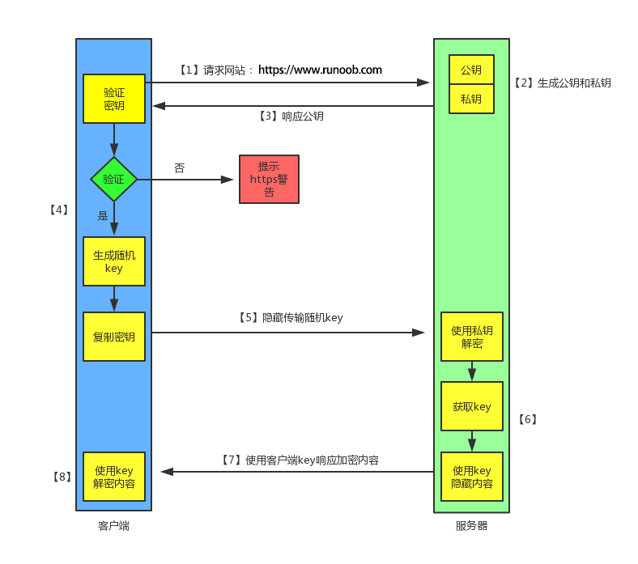

#### 区别

* HTTP 是互联网上应用最为广泛的一种网络协议, 是一个客户端和服务器端请求和应答的标准(TCP), 用于从服务器传输超文本到本地浏览器的传输协议, 它可以使浏览器更加高效.

* HTTPS: 是以安全为目标的 HTTP 通道, 简单讲是 HTTP 的安全版, 即 HTTP 下加入 SSL 层, HTTPS 的安全基础是 SSL, 因此加密的详细内容就需要 SSL . HTTPS 协议的主要作用可以分为两种: 一种是建立一个信息安全通道, 来保证数据传输的安全; 另一种就是确认网站的真实性.

HTTP 协议传输的数据都是==未加密的, 也就是明文的==, 因此使用 HTTP 协议传输隐私信息非常不安全, 为了保证这些隐私数据能加密传输, 于是网景公司设计了 ==SSL(Secure Sockets Layer, 安全套接字)==协议用于对 HTTP 协议传输的数据进行加密, 从而就诞生了 HTTPS. 简单来说, HTTPS 协议是由 SSL+HTTP 协议构建的可进行加密传输、 身份认证的网络协议, 要比http协议安全.

HTTPS和HTTP的区别主要如下:

1、 https 协议需要到 ca 申请证书, 一般免费证书较少, 因而需要一定费用.

2、 http 是超文本传输协议, 信息是明文传输, https 则是具有安全性的 ssl 加密传输协议.

3、 http 和 https 使用的是完全不同的连接方式, 用的端口也不一样, 前者是 80, 后者是 443.

4、 http 的连接很简单, 是无状态的; HTTPS 协议是由 SSL + HTTP 协议构建的可进行加密传输、 身份认证的网络协议, 比http 协议安全.

#### HTTPS 的工作原理

客户端在使用 HTTPS 方式与 Web 服务器通信时有以下几个步骤, 如图所示.

1. 客户端发起 HTTPS 请求

这个没什么好说的, 就是用户在浏览器里输入一个 https 网址, 然后连接到 server 的 443 端口.

2. 服务端的配置

采用 HTTPS 协议的服务器必须要有一套数字证书, 可以自己制作, 也可以向组织申请, 区别就是自己颁发的证书需要客户端验证通过, 才可以继续访问, 而使用受信任的公司申请的证书则不会弹出提示页面(startssl 就是个不错的选择, 有 1 年的免费服务).

这套证书其实就是一对公钥和私钥, 如果对公钥和私钥不太理解, 可以想象成一把钥匙和一个锁头, 只是全世界只有你一个人有这把钥匙, 你可以把锁头给别人, 别人可以用这个锁把重要的东西锁起来, 然后发给你, 因为只有你一个人有这把钥匙, 所以只有你才能看到被这把锁锁起来的东西.

3. 传送证书

这个证书其实就是公钥, 只是包含了很多信息, 如证书的颁发机构, 过期时间等等.

4. 客户端解析证书

这部分工作是有客户端的TLS来完成的, 首先会验证公钥是否有效, 比如颁发机构, 过期时间等等, 如果发现异常, 则会弹出一个警告框, 提示证书存在问题.

如果证书没有问题, 那么就生成一个随机值, 然后用证书对该随机值进行加密, 就好像上面说的, 把随机值用锁头锁起来, 这样除非有钥匙, 不然看不到被锁住的内容.

5. 传送加密信息

这部分传送的是用证书加密后的随机值, 目的就是让服务端得到这个随机值, 以后客户端和服务端的通信就可以通过这个随机值来进行加密解密了.

6. 服务端解密信息

服务端用私钥解密后, 得到了客户端传过来的随机值(私钥), 然后把内容通过该值进行对称加密, 所谓对称加密就是, 将信息和私钥通过某种算法混合在一起, 这样除非知道私钥, 不然无法获取内容, 而正好客户端和服务端都知道这个私钥, 所以只要加密算法够彪悍, 私钥够复杂, 数据就够安全.

7. 传输加密后的信息

这部分信息是服务段用私钥加密后的信息, 可以在客户端被还原.

8. 客户端解密信息

客户端用之前生成的私钥解密服务段传过来的信息, 于是获取了解密后的内容, 整个过程第三方即使监听到了数据, 也束手无策.

##### 缺点

HTTPS的缺点

　　虽然说 HTTPS 有很大的优势, 但其相对来说, 还是存在不足之处的:

1. HTTPS 协议握手阶段比较费时, 会使页面的加载时间延长近50%, 增加10%到20%的耗电; 

2. HTTPS 连接缓存不如 HTTP 高效, 会增加数据开销和功耗, 甚至已有的安全措施也会因此而受到影响; 

3. SSL 证书需要钱, 功能越强大的证书费用越高, 个人网站、 小网站没有必要一般不会用.

4. SSL 证书通常需要绑定IP, 不能在同一 IP 上绑定多个域名, IPv4资源不可能支撑这个消耗.

5. HTTPS 协议的加密范围也比较有限, 在黑客攻击、 拒绝服务攻击、 服务器劫持等方面几乎起不到什么作用. 最关键的, SSL证书的信用链体系并不安全, 特别是在某些国家可以控制 CA 根证书的情况下, 中间人攻击一样可行.

#### HTTP 切换到 HTTPS

这里需要将页面中所有的链接, 例如 js, css, 图片等等链接都由 http 改为 https.
