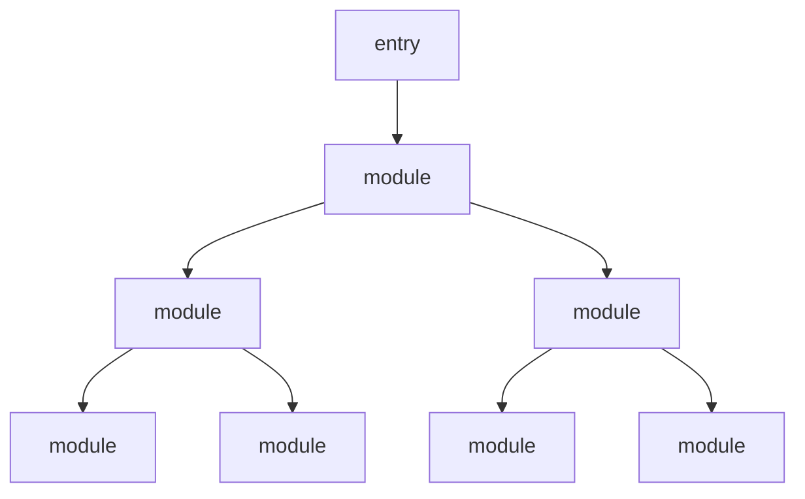
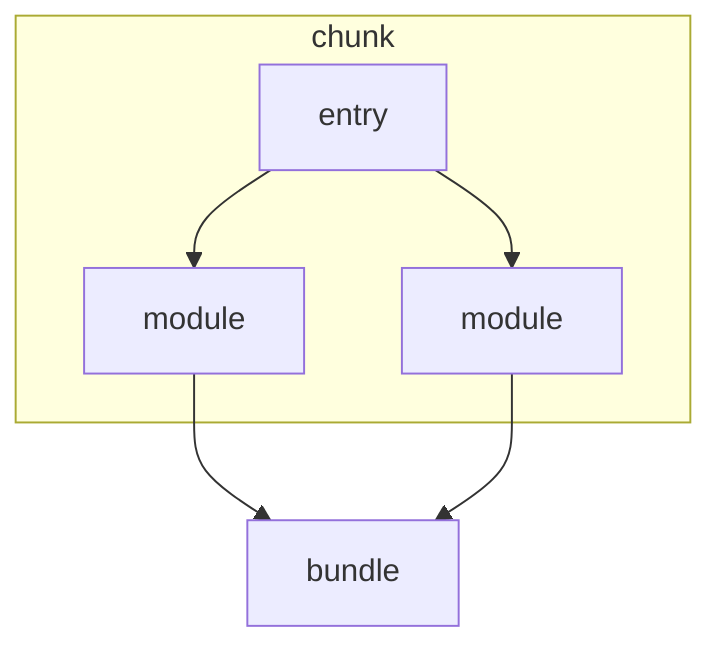
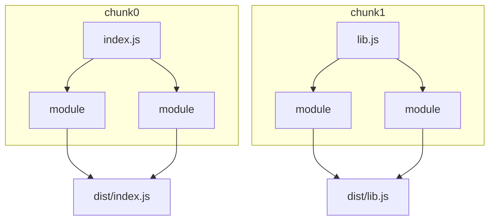

#### 资源处理流程

在一切流程的最开始, 我们需要指定一个或多个入口(entry), 也就是告诉 webpack 具体从源码目录下的哪个文件开始打包, 如果把工程中各个模块的依赖关系当作一棵树, 那么入口就是这棵依赖树的根.

这些存在依赖关系的模块在打包的时候被封装为一个 chunk . chunk 的字面意思是代码块, 在 webpack 中可以理解成被抽象和包装过后的一些模块. 它就像一个装着很多文件的文件袋, 里面的文件就是各个模块, webpack 在外面加了一层包裹, 从而形成了 chunk, 根据具体配置不同, 一个工程打包时可能会产生一个或多个 chunk.



entry、 chunk、 bundle的关系如下图所示



在工程中可以定义多个入口, 每一个入口都会产生一个结果资源. 如果有两个入口 `src/index.js` 和 `src/lib.js` , 在一般情形下会打包生成 `dist/index.js` 和 `dist/lib.js` , 所以 entry 与 bundle 存在着对应关系:



#### 配置资源入口

webpack 通过 `context` 和 `entry` 这两个配置项来共同决定入口文件的路径. 在配置入口时, 实际上做了两件事情:
* 确定入口模块位置, 告诉 webpack 从哪里开始进行打包.
* 定义 chunk name, 如果工程只有一个入口, 那么默认其 chunk name 为 main, 如果有多个入口, 我们需要为每个入口定义 chunk name, 来作为该 chunk 的唯一标识.

##### `context`

`context` 可以理解为资源入口的路径前缀, 在配置时要求必须使用绝对路径的形式.

```javaScript
module.exports = {
    context: path.join(__dirname, "./src"),
    entry: "./scripts/index.js"
};
module.exports = {
    context: path.join(__dirname, "./scripts"),
    entry: "./index.js"
};
```

这两种配置达到了的效果是相同的, 入口都为 `<工程根路径>/src/scripts/index.js` .

配置 `context` 的主要目的是让 `entry` 的编写更加简洁, 尤其在多入口的情况下.

`context` ==可以省略, 默认值为当前工程的根目录==.

##### `entry`

与 `context` 只能为字符串不同, `entry` 的配置可以有多种形式: 字符串、 数组、 对象、 函数. 可以根据不同的需求场景来选择.

###### 字符串

直接传入文件路径:

```javaScript
module.exports = {
    entry: "./src/index.js",
    output: {
        filename: "bundle.js",
    },
    mode: "development"
};
```

###### 数组

传入一个数组的作用是将多个资源==预先合并==, 在打包时 webpack 会将数组中的最后一个元素作为实际的入口路径:

```javaScript
module.exports = {
    entry: ["babel-polyfill", "./src/index.js"],
};
```

等同于:

```javaScript
// webpack.config.js
module.exports = {
    entry: "./src/index.js",
};

// index.js
import "babel-polyfill"
```

###### 对象

==如果想要定义多入口, 则必须使用对象形式==, 对象的属性名( `key` )是 chunk name, 属性值( `value` )是入口路径:

```javaScript
module.exports = {
    entry: {
        index: "./src/index.js",
        lib: "./src/lib.js",
    },
};
```

对象的属性值也可以为字符串或数组:

```javaScript
module.exports = {
    entry: {
        index: ["babel-polyfill", "./src/index.js"],
        lib: "./src/lib.js",
    },
};
```

在使用字符串或数组定义单入口时, 并没有办法更改 chunk name, 只能为默认的 main. 在使用对象来定义多入口时, 则==必须为每一个入口定义 chunk name.==

###### 函数

用函数定义入口时, 只要返回上面介绍的任何配置形式即可.

传入一个函数的优点在于我们可以在函数体里添加一些动态的逻辑来获取工程的入口, 同时它也支持返回一个 Promise 对象来进行异步操作:

```javaScript
module.exports = {
    entry: () => new Promise((resolve, reject) => {
        // 模拟异步操作
        setTimeout(() => {
            resolve("./src/index.js")
        }, 1000);
    });
};
```

##### 实例

###### 单页应用

对于单页应用(SPA)来说, 一般定义单一入口即可:

```javaScript
module.exports = {
    entry: "./src/app.js"
}
```

无论是框架, 库还是各个页面的模块, 都由 app.js 单一的入口进行引用. 这样做的好处是只会产生一个JS文件, 依赖关系清晰. 但是这种情况下所有模块都会打包到一起, 当应用的规模上升到一定程度之后会导致产生的资源体积过大, 降低用户的页面渲染速度.

在 webpack 默认配置中, 当一个 bundle 大于 250kb (压缩前)会人为这个 bundle 已经过大了, 在打包时会发生警告.

###### 提取vendor

当一个工程只产生一个JS文件并且它的体积很大, 一旦代码产生更新, 即便只有一点点改动, 用户都要重新下载整个资源文件.

为了解决这个问题, 我们可以使用提取 vendor 的方法. vendor 的意思是"供应商", 在 webpack 中 vendor 一般指的是工程所使用的库、 框架等第三方模块集中打包而产生的bundle. 例如:

```javaScript
module.exports = {
    context: path.join(__dirname, "./src"),
    entry: {
        app: "./src/app.js",
        vendor: ["react", "react-dom", "react-router"]
    }
};
```

这里添加了一个新的 chunk name 为 `vendor` 的入口, 并通过数组的形式把工程依赖的第三方模块放了进去.

但是这里的 `vendor` 并没有设置入口路径. 我们可以使用 CommonsChunkPlugin (webpack4 之后 CommonsChunkPlugin 已经被废弃, 可以采用 Optimization.splitChunks), 将 `app` 和 `vendor` 这两个chunk 中的公共模块提取出来. 这样 app.js 产生的 bunle 将只包含业务模块, 其依赖的第三方模块将会被抽取出来生成一个新的 bundle, 这就达到了我们提取 `vendor` 的目标. 由于 `vendor` 仅仅包含第三方模块, 这部分不会经常变动, 因此可以有效的利用客户缓存, 在用户后续请求页面时会加快整体的渲染速度.

##### 多页应用

对于多页应用, 为了尽可能减小资源的体积, 我们希望每个页面都只加载各自必要的逻辑, 而不是将所有页面打包到同一个 bundle.js 中, 因此每个页面都需要有一个独立的 bundle. 这可以用多入口来实现:

```javaScript
module.exports = {
    entry: {
        pageA: "./scr/pageA.js",
        pageB: "./scr/pageB.js",
        pageC: "./scr/pageC.js",
    }
};
```

这样入口与页面是一一对应的关系, 每个 HTML 只要引入各自的 JS 就可以加载其所需要的模块.

同时, 对于多页应用的场景, 同样可以使用提取 vendor 的方法, 将各个页面之间的公共模块进行打包:

```javaScript
module.exports = {
    entry: {
        pageA: "./src/pageA.js",
        pageB: "./src/pageB.js",
        pageC: "./src/pageC.js",
        vendor: ["react", "react-dom"]
    }
};
```

#### 配置资源出口

与所有出口相关的配置都集中在 `output` 对象里:

```javaScript
const path = require("path")
module.exports = {
    entry: "./src/app.js",
    output: {
        filename: "bundle.js",
        path: path.join(__dirname, "assets"),
        publicPath: "/dist/"
    }
}
```

`output` 对象里可以包含数十个配置项, 其中的大多数在日常开发中使用频率都不高, 下面是常用的几个配置项.

##### `filename`

`filename` 的作用是控制输出资源的文件名, 其形式为字符串:

```javaScript
const path = require("path")
module.exports = {
    entry: "./src/app.js",
    output: {
        filename: "bundle.js",
    }
}
```

它还可以是一个相对路径, 即便路径中的目录不存在也没关系, webpack 在输出资源时会==自动创建该目录==.

在多入口场景中, 我们需要为对应产生的每个 bundle 指定不同的名字, webpack 支持使用一种类似==模板语言==的形式==动态==地生成文件名:

```javaScript
module.exports = {
    entry: {
        app: "./src/app.js",
        vendor: "./src/vendor.js"
    },
    output: {
        filename: "[name].js"
    }
};
```

在资源输出时, `[name]` 会被替换为 chunk name.

还有其他集中模板变量可以用于 `filename` 的配置:

|  变量名称   | 功能描述  |
|  ----  | ----  |
| `[hash]` | 指代 weback 此次打包所有资源生成的 hash |
| `[chunkhash]` | 指代当前 chunk 内容的 hash |
| `[id]` | 指代当前 chunk 内容的 id |
| `[query]` | 指代 filename 配置项中的 query |

上述变量一般有如下两种作用:
* 当有多个 chunk 存在时对不同的 chunk 进行区分. 如`[name]`、 `[chunkhash]`、 `[id]`, 它们对于每个 chunk 来说都是不同的.
* 控制客户端缓存. 表中的 `[hash]` 和`[chunkhash]` 都与 chunk 内容直接相关, 在 `filename` 中使用了这些变量之后, 当 chunk 内容改变时, 可以同时引起资源文件名的更改, 从而==使用户在下一次请求资源文件时会立即下载新的版本而不会使用本地缓存==.`[query]`也可以有类似的效果, 但是它与 chunk 的内容无关, 需要开发者手动决定.
  
实际开发中使用比较多的是 `[name]` , 它与 chunk 是一一对应的关系, 并且可读性较高. 如果要控制客户端缓存, 最好还要加上 `[chunkhash]` , 因为每个 chunk 所产生的 `[chunkhash]` 只与自身内容有关, 单个 chunk 内容的 改变不会影响其他资源, 可以最精确地让客户端缓存得到更新.

```javaScript
module.exports = {
    entry: {
        app: "./src/app.js",
        vendor: "./src/vendor.js"
    },
    output: {
        filename: "[name]@[chunkhash].js"
    }
};
```

另外, 更新缓存一般只用在生产环境的配置中, 在开发环境可以不必配置.

##### `path`

`path` 可以指定资源输出的位置, 要求值必须为==绝对路径==:

```javaScript
const path = require("path")
module.exports = {
    entry: "./src/app.js",
    output: {
        filename: "bundle.js",
        path: path.join(__dirname, "dist"),
    }
}
```

上述配置将资源输出位置设置为工程的 dist 目录. 在 webpack 4 之前, 打包资源默认会生成在工程根目录, 因此我们需要上述配置. 而在 webpack 4 之后, `output.path` 已经默认为 dist 目录, 除非我们需要更改它, 否则不必单独配置.

##### `publicPath`

`publicPath` 是一个非常重要的配置, 并且容易与 `path` 相混淆, 从功能上来说, `path` 用来指定资源的==输出位置==, 而 `publicPath` 则用来指定资源的==请求位置==.
* 输出位置: 打包完成后资源产生的目录, 一般将其指定为工程中的 dist 目录.
* 请求位置: 由 js 或 css 所请求的==间接资源路径==. 页面中的资源分为两种, 一种是由 html 页面直接请求的, 比如通过 `script` 标签加载的 js, 另一种是由 js 或者 css 请求的, 如异步加载的 js、 从 css 请求的图片字体等.`publicPath`的作用就是指定这部分间接资源的请求位置.

`publicPath` 由三种形式:

###### html 相关

与 html 相关, 也就是说我们可以将 `publicPath` 指定为 html 的相对路径, 在请求这些资源时会以当前页面 html 所在路径上加上相对路径, 构成实际请求的 url:

```javaScript
// 假设当前 html 地址为 https://example.com/app/index.html
// 异步加载的资源名为 0.chunk.js
publicPath： "" // 实际路径 https://example.com/app/0.chunk.js
publicPath： "./js" // 实际路径 https://example.com/app/js/0.chunk.js
publicPath： "../assets" // 实际路径 https://example.com/assets/0.chunk.js
```

###### host 相关

若 `publicPath` 的值以 `/` 开始, 则代表时 `publicPath` 是以当前页面的 host name 为基础路径的.

```javaScript
// 假设当前 html 地址为 https://example.com/app/index.html
// 异步加载的资源名为 0.chunk.js
publicPath： "" // 实际路径 https://example.com/0.chunk.js
publicPath： "/js/" // 实际路径 https://example.com/js/0.chunk.js
publicPath： "/dist/" // 实际路径 https://example.com/dist/0.chunk.js
```

###### CDN 相关

上面两种配置都是相对路径, 也可以使用绝对路径形式配置 `publicPath` . 这种情况一般发生于静态资源放置于 CDN 上面时, 由于其域名与当前域名不一致, 需要以绝对路径的形式进行指定. 当 `publicPath` 以协议头或相对协议的形式开始时, 代表当前路径 CDN 相关:

```javaScript
// 假设当前 html 地址为 https://example.com/app/index.html
// 异步加载的资源名为 0.chunk.js
publicPath： "http://cdn.com/" // 实际路径 http://cdn.com/0.chunk.js
publicPath： "https://cdn.com/" // 实际路径 https://cdn.com/0.chunk.js
publicPath： "//cdn.com/assets" // 实际路径 //cdn.com/assets/0.chunk.js
```

webpack-dev-server 的配置中也有一个 `publicPath` , 但是这个 `publicPath` 与 webpack 中配置项含义不同, 它的作用是指定 webpack-dev-server 的静态资源服务路径:

```javaScript
const path = require("path")
module.exports = {
    entry: "./src/app.js",
    output: {
        filename: "bundle.js",
        path: path.join(__dirname, "dist"),
    },
    devServer: {
        publicPath: "/assets/",
        port: 3000
    }
}
```

从上面可以看到, webpack 配置中 `output.path` 为 `dist` 目录, 因此 `bundle.js` 应该生成在 dist 目录. 因此 bundle.js
应该生成在 dist 目录. 但是当启动 weback-dev-server 的服务后, 访问 `localhost:3000/dist/bundle.js` 却会得到 404. 这是因为 `devServer.publicPath` 配置项将资源位置指向了 `localhost:3000/assets` , 因此只有访问 `localhost:3000/assets/bundle.js` 才能得到我们想要的结果.

为了避免开发环境和生产环境产生不一致而造成开发者的疑惑, 我们可以将 weback-dev-server 的 `publicPath` 与 webpack 中的 `output.path` , 这样在任何环境下资源输出的目录都是相同的:

```javaScript
const path = require("path")
module.exports = {
    entry: "./src/app.js",
    output: {
        filename: "bundle.js",
        path: path.join(__dirname, "dist"),
    },
    devServer: {
        publicPath: "/dist/",
        port: 3000
    }
}
```

##### 实例

###### 单入口

对于单入口的场景来说, 通常不必设置动态的 `output.filename` , 直接指定输出的文件名即可:

```javaScript
const path = require("path")
module.exports = {
    entry: "./src/app.js",
    output: {
        filename: "bundle.js",
    },
    devServer: {
        publicPath: "/dist/",
    }
}
```

上面是通常情况下的配置. 工程源码目录为 src, 资源输出目录为 dist (weback 4 以后已经默认). 此时还不需要配置 `output.publicPath` , 但是对于 weback-dev-server 来说需要为其自定资源的服务路径, 因此将 `devServer.publicPath` 设置为 `/dist/` .

###### 多入口

在多入口情况下, 需要用模板变量来配置 `filename` :

```javaScript
const path = require("path")
module.exports = {
    entry: {
        pageA: "./src/pageA.js/",
        pageB: "./src/pageB.js/",

    }
    output: {
        filename: "[name].js",
    },
    devServer: {
        publicPath: "/dist/",
    }
}
```
