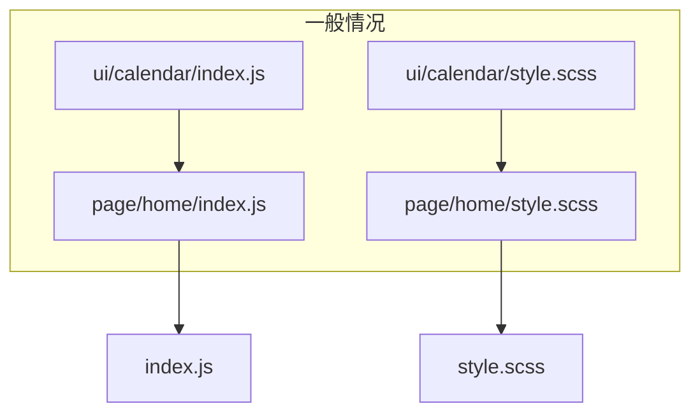
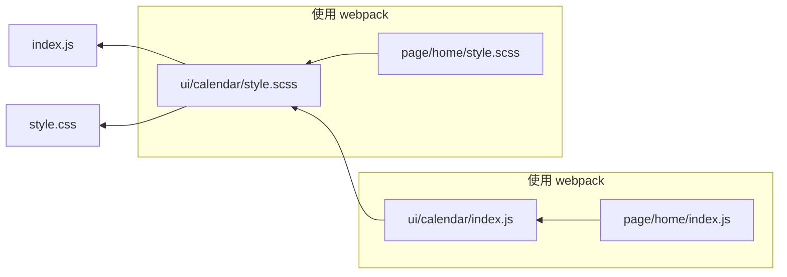

#### 预处理器

预处理器赋予了 webpack 可处理不同资源类型的能力, 极大的丰富了其可扩展性.

#### 一切皆模块

对于 webpack 来说, html、 js、 css、 模板、 图片、 字体等多种类型的静态资源都是模块, 可以像加载一个 js 文件一样去加载它们, 例如加载一个 css 文件:

```javaScript
// index.js
import "./style.css"
```

如果一个页面用到了一个日历组件, 我们需要把它加载进来:

```javaScript
// ./page/home/index.js
import Calendar from "./ui/calendar/index.js"
```

还需要引入 `calendar` 组件的样式:

```javaScript
// ./ui/page/style.scss
@import Calendar from "./ui/calendar/style.scss"
```

通过 webpack 可以用一种更简洁的方式来表达这种依赖关系:

```javaScript
// ./ui/calendar/index.js
import Calendar from "./style.scss"; // 引用组件自身样式
...

// ./page/home/index.js
import Calendar from "./ui/calendar/index.js";
import "./style.scss"; // 引用页面自身样式
```

可以看到, 在 `calendar` 的 js 中加载了其组件自身的样式, 而对于页面来说只要加载 calendar.js (以及页面自身的样式), 不需要额外引入组件的样式:





可以看到, webpack 中组件的 js 和 scss 作为一个整体被页面引入进来, 这样就更加清晰地描述了资源之间的关系. 避免了添加或删除一个组件的时候都要进行两次操作的情况.

#### loader 概述

每个 loader 本质上都是一个函数. 在 webpack 4 之前函数的输入和输出都必须为字符串; 在 webpack 4 之后, loader 也同时支持抽象语法树(AST)传递, 通过这种方式来减少重复代码的解析, 用公式表达 `loader` 的本质则为以下形式:

$output = loader(input)$

这里的 `input` 可能是工程源文件的字符串, 也可能是上一个 `loader` 转化后的结果, 包括转化后的结果(也是字符串类型)、 source map、 以及 AST 对象; `output` 同样包含这几种信息. 如果这是最后一个 `loader` , 结果将直接被送到 webpack 进行后续处理, 否则将作为下一个 `loader` 的输入向后传递.

例如使用 `babel-loader` 将 ES6+ 的代码转化为 ES5时:

$ES5 = loader(ES6+)$

`loader` 可以是链式的. 我们可以对一种资源设置多个 `loader` , 第一个 `loader` 的输入是文件源码, 之后所有 `loader` 的输入都为上一个 `loader` 的输出:

$output = loaderA(loaderB(loaderC(input)))$

例如编译 SCSS 时:

$Style标签 = style-loader(css-loader(sass-loader(SCSS)))$

下面是 `loader` 的源码结构:

```javaScript
module.exports = function loader(content, map, meta) {
    var callback = this.async()
    var result = handler(content, map, meta)
    callback(
        null, // error
        result.content, //转换后的内容
        result.map, // 转换后的 source-map
        result.meta, // 转换后的 AST
    )
}
```

可以看出, `loader` 本身就是一个函数, 在该函数中对接收到的内容进行转换, 然后返回转换后的结果.

#### loader 的配置

`loader` 的字面意思是装载器, ==在 webpack 中它的实际功能则更像是预处理器.webpack 本身只认识 js, 对于其他类型的资源必须预先定义一个或多个 `loader` 对其进行转译, 输出为 webpack 能够接收的形式再继续进行==, 因此 `loader` 做的实际上是一个预处理的工作.

##### loader的引入

假设要处理CSS, 按照"一切皆模块"的思想, 从一个js文件加载一个css文件:

```javaScript
// index.js
import './style.css';

// style.css
body {
    text - align: center;
    padding: 100 px;
    color: #fff;
    background - color: #09c;
}
```

这是直接打包会报错

```
You may need an appropriate loader to handle this file type, currently no loaders are configured to process this file.
```

webpack 无法处理 css 语法, 所以抛出错误提示需要使用一个合适的 `loader` 来处理这种文件. 这里是需要使用 `css-loader`

`loader` 都是一些第三方 npm 模块, webpack 本身并不包含任何 `loader` , 因此需要先安装:

```
npm install css-loader
```

然后将 `loader` 引入工程中:

```javaScript
module.exports = {
    ...
    module: {
        rules: [{
            test: /\.css$/,
            use: ['css-loader']
        }]
    }
};
```

与 `loader` 相关的配置都在 `module` 对象中, 其中 `module.rules` 代表了模块的处理规则, 每条规则内部可以包含很多配置项, 这里只使用了最重要的两项 `test` 和 `use` :
* `test`: 可以接收一个正则表达式或者一个元素为正则表达式的数组, 只有正则匹配上的模块才会使用这条规则. 在这里用`/\.css$/`来匹配所有以 .css 结尾的文件.
* `use`: 可接收一个数组, 数组包含该规则所使用的`loader`. 在这里只配置来一个`css-loader`, 在只有一个`loader`时也可以简化为字符串`"css-loader"`.
  
现在再进行打包, 之前的错误应该消失了, 但是 css 的样式仍然无法生效. 这是因为 `css-loader` 的作用仅仅是处理 css 的各种加载语法( `@import` 和 `url()` 函数等), 如果羕样式起作用还需要 `style-loader` 来把样式插入页面. 这两个 `loader` 通常是配合在一起的.

安装 `style-loader` :

```javaScript
npm install style - loader
```

然后更改 `rules` 中的规则:

```javaScript
module: {
    rules: [{
        test: /\.css$/,
        use: ['style-loader', 'css-loader']
    }]
}
```

==这里 `use` 中的 `style-loader` 必须写在 `css-loader` 的前面==, 因为 webpack 打包时是按照数组==从后往前==的顺序将资源交给 `loader` 处理的, 因此要把最后生效的放在最前面.

现在再进行打包, 可以看到页面中插入了一个 `style` 标签, 包含来 css 文件的样式, 这样就完成了从 js 文件 加载 css 文件的配置.

##### 链式 loader

很多时候, 在处理某一类资源的时候我们都需要使用多个 `loader` . 例如 SCSS 类型的资源来说, 需要 `sass-loader` 来处理其语法, 并将其编译为 css; 再用上面的两个 `loader` 继续处理.

##### loader options

`loader` 作为预处理器通常会给开发者提供一些配置项, 在引入 `loader` 的时候可以通过 `options` 将它们传入:

```javaScript
rules: [{
    test: /\.css$/,
    use: [
        'style-loader',
        {
            loader: 'css-loader',
            options: {
                // css-loader配置项
            }
        }
    ],
}]
```

有些 `loader` 可能会使用 `query` 来代替options, 从功能上来说它们并没有太大区别.

##### 更多配置

###### `exclude` 和 `include`

`exclude` 和 `include` 用来排除或包含指定目录下的模块, 可接收正则表达式或者字符串(文件绝对路径), 以及由它们组成的数组:

```javaScript
rules: [{
    test: /\.css$/,
    use: ['style-loader', 'css-loader'],
    exclude: /node_modules/,
}]
```

这里的 `exclude` 表示所有被正则匹配到的模块都排除在该规则之外, 也就是说 node_modules 中的模块不会执行这条规则. 该配置项通常是必须添加的, 否则可能拖慢整体的打包速度.

例如 `babel-loader` 用于处理 ES6+ 语言特性, 但是对于 node_modules 中的 js 文件来说, 很多都是已经编译为 ES5 了, 这时就没有必要使用 `babel-loader` 来进行额外处理.

`include` 配置也可以达到类似的效果:

```javaScript
rules: [{
    test: /\.css$/,
    use: ['style-loader', 'css-loader'],
    exclude: /node_modules/,
    include: /src/,
}]
```

`include` 表示该规则只对正则匹配到的模块生效.

`exclude` 和 `include` 同时存在时, == `exclude` 的优先级更高==:

```javaScript
rules: [{
    test: /\.css$/,
    use: ['style-loader', 'css-loader'],
    exclude: /node_modules/,
    include: /node_modules\/awesome-ui/,
}]
```

此时 node_modules 已经被排除了, 如果想要该规则对 node_modules 中的某一个模块生效, 即便加上 `include` 也无法覆盖 `exclude` 中的配置. 只能通过修改 `exclude` 中的正则:

```javaScript
rules: [{
    test: /\.css$/,
    use: ['style-loader', 'css-loader'],
    // 排除 node_modules 中除了 foo 和 bar 以外的所有模块
    exclude: /node_modules\/(?!(foo|bar)\/).&/,
}]
```

另外, 由于 `exclude` 优先级更高, 我们可以对 `include` 中的子目录进行排除:

```javaScript
rules: [{
    test: /\.css$/,
    use: ['style-loader', 'css-loader'],
    exclude: /src\/lib/,
    include: /src/,
}]
```

这样可以让该规则对与 src 目录中除 lib 目录以外的模块生效.

###### `resource` 和 `issuer`

`resource` 和 `issuer` 可用于更加精确地确定模块规则的作用范围:

```javaScript
// index.js
import "./style.css"
```

在 webpack 中, 我们认为被加载模块是 `resource` , 而加载者是 `issuer` . 上面代码中 `resource` 为 style.css, 而 `issuer` 为index.js.

前面介绍的 `test` 、 `exclude` 和 `include` 本质上属于对 `resource` 也就是被加载者的配置. 如果想要对 `issuer` 加载者也增加条件限制, 则需要额外写一些配置.

例如只想让 `/src/pages` 目录下的 js 可以引用 css:

```javaScript
rules: [{
    test: /\.css$/,
    use: ['style-loader', 'css-loader'],
    exclude: /node_modules/,
    issuer: {
        test: /\.js$/,
        include: /src/pages / ,
    }
}]
```

这种写法虽然能实现效果, 但是 `test` 、 `exclude` 和 `include` 这些配置项分布在不同的层级上, 可读性较差. 我们可以用另一种形式:

```javaScript
rules: [{
    test: /\.js$/,
    exclude: /node_modules/,
    use: [{
        loader: 'babel-loader',
        options: {
            presets: ['@babel/preset-env'],
            plugins: [
                [require('@babel/plugin-transform-runtime'), {
                    legacy: true
                }],
                [require('@babel/plugin-proposal-class-properties'), {
                    legacy: true
                }]
            ]
        }
    }]
}]
```

上面的配置与把 `resource` 的配置写在外层本质上是一样的, 然而这两种形式无法并存, 只能选择一种.

###### `enforce`

`enforce` 用来指定一个 `loader` 的种类, 只接收 `"pre"` 或者 `"post"` 两种字符串类型的值.

webpack 中的 `loader` 按照执行顺序可分为 `pre` 、 `inline` 、 `normal` 和 `post` 四种类型, 上面我们直接定义的 `loader` 都属于 `normal` 类型, `inline` 形式官方已经不推荐使用, 而 `pre` 和 `post` 则需要使用 `enforce` 来指定:

```javaScript
rules: [{
    test: /\.js$/,
    enforce: "pre",
    use: "eslint-loader"
}]
```

这里添加了一个 `eslint-loader` 来对源码进行质量检测, 它的 `enforce` 值为 `"pre"` , 代表它将在所有正常的 `loader` ==之前==执行, 这样可以保证其检测的代码不是被其他 `loader` 更改过的.

同样, 当 `enforce` 值为 `"post"` 时, 它将在所有的 `loader` 之后执行.

实际上也可以不使用 `enforce` 而只要保证 `loader` 顺序正确即可, 但是在实际工程中, 配置文件代码较多时, 使用 `enforce` 可以强制指定 `loader` 的作用顺序, 并且使代码更加清晰, 可读性更强.

#### 常用 loader

##### babel-loader

`babel-loader` 用来处理 ES6+ 并将其编译为 ES5.

安装命令:

```
npm install babel-loader @babel/core @babel/plugin-proposal-class-properties @babel/plugin-transform-runtime @babel/preset-env @babel/runtime --save-dev
```

其中各个模块的作用如下:
* `babel-loader`: 使 Babel 与 webpack 协同工作的模块.
* `@babel/core`: Babel 编译器的核心模块.
* `@babel/preset-env`: Babel 官方推荐的预置器, 可根据用户设置的目标环境自动添加所需的插件和布丁来编译 ES6+ 代码.
* `@babel/plugin-proposal-class-properties`: 用来编译类.
* `@babel/plugin-transform-runtime`: 用来代码, 转译后的代码可能会引入`@babel/runtime-corejs3` 里面的模块. 所以前者运行在编译时, 后者运行在运行时.
* `babel-runtime`: 用以提供编译模块的工具函数, 启用插件`babel-plugin-transform-runtime`后, `babel`就会使用`babel-runtime下`的工具函数.

配置成功 `babel` 后, 打包生成的 bundle.js 文件中的代码会自动转译成 ES5 的语法. 但是 webpack 生成文件默认配置的语法不会受到影响. 例如最外层的立即执行函数仍然是一个箭头函数的形式, 可以通过修改 webpack.config.js 的配置项来实现这部分代码的转译.

```javaScript
module.exports = {
    target: ['web', 'es5'],
}
```

##### ts-loader

`ts-loader` 与 `babel-loader` 类似, 用于连接 webpack 与 Typescript 的模块.
可以使用以下命令进行安装:

```
npm install ts-loader typescript --save-dev
```

webpack 配置如下

```javaScript
rules: [{
    test: /\.ts$/,
    use: "ts-loader"
}]
```

需要注意的是, Typescript 本身的配置并不在 `ts-loader` 中, 而是必须要放在工程目录下的 tsconfig.json 中:

```javaScript
{
    "compilerOptions": {
        "target": "es5",
        "sourceMap": true
    }
}
```

##### html-loader

`html-loader` 用于将 html 文件转化为字符串并进行格式化, 这使得我们可以把一个 html 片段通过 js 加载进来.

安装命令如下:

```
npm install html-loader --save-dev
```

webpack 配置规则

```javaScript
rules: [{
    test: /\.html$/,
    use: "html-loader"
}]
```

使用示例如下:

```HTML
<!-- header.html -->
<header>
    <h1>This is a Header.</h1>
</header>
```

```javaScript
// index.js
import headerHtml from './header.html';
document.write(headerHtml);
```

header.html 将会转化为字符串, 并通过 `document.write()` 插入页面中.

##### handlebars-loader

`handlebars-loader` 用于处理 handlebars 模板, 在安装时要额外安装 handlebars:

```
npm install handlebars-loader handlebars --save-dev
```

webpack 配置:

```javaScript
rules: [{
    test: /\.handlebars$/,
    use: 'handlebars-loader'
}]
```

使用示例如下:

```HTML
<!-- content.handlebars -->
<div class="entry">
    <h1>{{ title }}</h1>
    <div class="body">{{ body }}</div>
</div>
```

```JS
// index.js
import contentTemplate from './content.handlebars';
const div = document.createElement('div');
div.innerHTML = contentTemplate({
    title: 'Title',
    body: 'Your books are due next Tuesday.'
});
document.body.appendChild(div);
```

==handlebars 文件加载后得到的是一个函数, 可以接收一个变量对象并返回最终的字符串.==

##### file-loader

`file-loader` 用于打包文件类型的资源, 并返回其 `publicPath` .

安装命令:

```
npm install file-loader --save-dev
```

webpack 配置如下:

```JS
const path = require('path');
module.exports = {
    entry: './src/index.js',
    output: {
        path: path.join(__dirname, 'dist'),
        filename: 'bundle.js'
    },
    module: {
        rules: [{
            test: /\.(png|jpg|gif|jpeg)$/,
            use: "file-loader"
        }]
    }
};
```

这样就可以在 js 中加载图片了:

```JS
import img from './image/WechatIMG8.jpeg';
console.log(img);
```

已经知道 `output.path` 是资源的打包输出路径, `output.publicPath` 是资源引用路径. dist 目录下会生成一个文件名为 hash 值的图片文件. 由于没有配置 `output.publicPath` , 因此这里打印出的图片路径是一个完整的 url 加上文件名.

添加 `output.publicPath` :

```JS
const path = require('path');
module.exports = {
    entry: './src/index.js',
    output: {
        path: path.join(__dirname, 'dist'),
        filename: 'bundle.js',
        publicPath: './assets/'
    },
    module: {
        rules: [{
            test: /\.(png|jpg|gif|jpeg)$/,
            use: "file-loader"

        }]
    }
};
```

现在打印出的图片路径就是 `./assets/c6fb3f31c73ec38a978b4652cebb46df.jpeg` 这样的一个相对路径的形式了.

`file-loader` 也支持配置文件名以及 `publicPath` (这里的 `publicPath` 会覆盖 `output.publicPath` ), 通过 `loader` 的 `options` 传入.

```JS
module.exports = {
    entry: './src/index.js',
    output: {
        path: path.join(__dirname, 'dist'),
        filename: 'bundle.js',
        publicPath: './assets/'
    },
    module: {
        rules: [{
            test: /\.(png|jpg|gif|jpeg)$/,
            use: {
                loader: 'file-loader',

                options: {
                    name: '[name].[ext]',
                    publicPath: './another-path/'
                }
            }
        }]
    }
};
```

现在可以看到打印出的图片路径发生了变化.

##### url-loader

`url-loader` 与 `file-loader` 作用类似, 唯一的不同在于用户可以设置一个文件大小的阈值. 当大于该阈值的时候与 `file-loader` 一样返回 `publicPath` , 而小于该阈值的时候返回文件 base64 形式编码.

```
npm install url-loader --save-dev
```

```JS
module.exports = {
    entry: './src/index.js',
    output: {
        path: path.join(__dirname, 'dist'),
        filename: 'bundle.js',
        publicPath: './assets/'
    },
    module: {
        rules: [{
            test: /\.(png|jpg|gif|jpeg)$/,
            use: {
                loader: 'url-loader',
                options: {
                    limit: 10240,
                    name: '[name].[ext]',
                    publicPath: './another-path/'
                }
            }
        }]
    }
};
```

除了其他参数与 `file-loader` 相同, `url-loader` 可以接收一个 `limit` 参数来控制返回一个 `publicPath` 还是 base64 形式编码.

##### vue-loader

`vue-loader` 可以用于处理 vue 组件:

```HTML
<template>
    <h1>{{title}}</h1>
</template>
<script>
    export default {
        name: 'app',
        data() {
            return {
                title: 'Welcome to your Vue.js App'
            };
        }
    };
</script>
<style lang="css" scoped>
    h1 {
        font-style: italic;
    }
</style>
```

webpack 中写入:

```JS
const {
    VueLoaderPlugin
} = require('vue-loader');
module.exports = {
    module: {
        rules: [{
                test: /\.vue$/,
                loader: 'vue-loader'
            },
            {
                test: /\.css$/,
                use: ['style-loader', 'css-loader']
            },
        ]
    },
    plugins: [
        // 请确保引入这个插件！
        new VueLoaderPlugin()
    ]
};
```

上面 `VueLoaderPlugin` 这个插件是必须的! 它的职责是将你定义过的其它规则复制并应用到 `.vue` 文件里相应语言的块. 例如, 如果你有一条匹配 `/\.js$/` 的规则, 那么它会应用到 `.vue` 文件里的 `<script>` 块.

然后在 index.js 中渲染一个 vue 组件:

```JS
import Vue from 'vue';
import App from './App.vue';

// render 写法
new Vue({
    render: h => h(App)
}).$mount('#app');
```

然后在 index.html 中创建一个 `id="app"` 的标签来挂载这个 vue 实例:

```HTML
<div id="app"></div>
<script src="./dist/bundle.js"></script>
```
#### 自定义 loader
