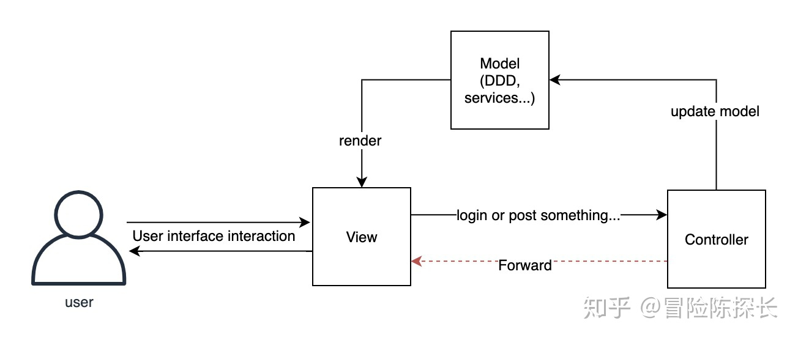
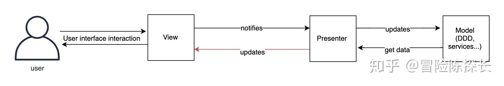
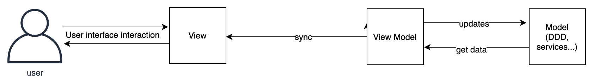

#### MVC 模式

为了解决直接操作 DOM 比较难维护的问题. 通常将页面上与 DOM 相关的内容抽象成数据模型、 视图、 事件控制函数三部分, 这就有了前端 MVC (Model-View-Controller)的设计思路.

MVC 可以认为是一种开发设计模式, 其基本思路是将 DOM 交互的内容分为数据模型、 视图和事件控制函数三个部分, 并对它们进行统一管理.

* Model: 用来存放请求的数据结果和数据对象.
* View: 用于页面 DOM 的更新与修改.
* Controller: 用于前端路由条件(例如不同的 HASH 路由)来调用不同 Model 给 View 渲染不同的数据内容.

一般来说, MVC 中的数据流动是单向的, Model 用数据来渲染 View, View 用户界面交互完成后更新数据, 然后 Controller 做分发和控制. 但是从交互的角度来看并不是单向的, 如上图中的红线, Controller 当收到更新数据请求的时候, Controller 会更新数据, 更新完就会重定向到的 View , View 拿到更新完的 Model 数据, 进行渲染, Controller 多充当了一个调度者的角色.

#### MVP

Model-View-Presenter 和 MVC 一样, M 就是 Model, V 就是 View, 而 P 代表 Presenter, 它与 Controller 有点相似, 但不同的是用户在进行 DOM 修改操作时将通过 View 上的行为触发, 然后将修改通知给 Presenter 来完成后面的 Model 修改和其他 View 的更新, 而 MVC 模式下, 用户的操作时直接通过 Controller 来控制的.

Model 和 View 是不直接发生关系的, 所有的逻辑调用数据 Model 和渲染视图都在 Presenter 里面完成, 同时用户在 View 操作层的改变会反馈到 Presenter 然后改变 Model 并渲染新的 View.

可以看出这时 View 和 Model 主要用于提供视图模板和数据而不做任何逻辑处理. Presenter 作为中间部分连接 Model 和 View 的通信交互完成所有的逻辑操作.

#### MVVM

MVVM 可以认为是一个自动化的 MVP 框架, 并且使用 ViewModel 代替了 Presenter, 即数据 Model 的调用和模板内容的渲染不需要我们主动操作, 而是 ViewModel 自动来触发完成.

MVVM 模式的亮点是 Mode 和 View Model 之间实现了双向绑定, 这一点也确实可以说是划时代, 解决了当时很多状态同步的问题, 如下图, 在这种模式下, 开发者可以专注开发 View 和 Model 的内容, 省去了同步 UI 和 Javascript 数据的繁琐.
