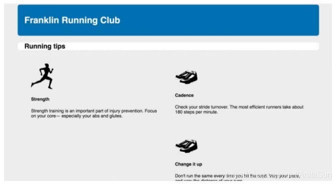
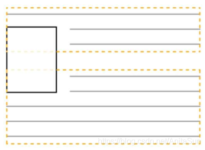
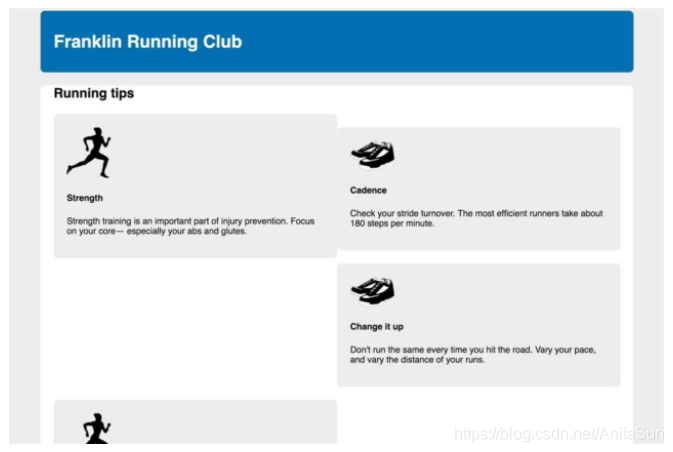
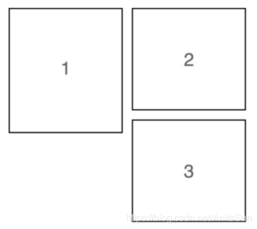
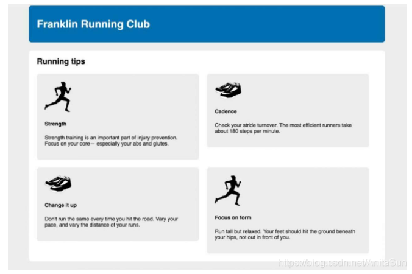
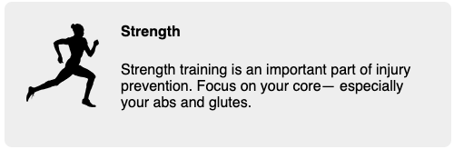
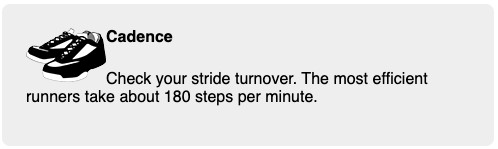

#### 浮动

要实现将图片移动到网页一侧并且让文字围绕图片的效果, 浮动仍然是唯一的方法.

#### 容器折叠

浮动元素不同于普通文档流的元素, 它们的高度不会加到父元素上.

例如将四个媒体盒子浮动到左侧, 可以看到本来应该出现在四个媒体盒子底部的白色背景仅仅出现在了Running tips下面.



在段落里浮动图片时, 段落的高度并不会增长到能容纳该图片. 如果图片比段落文字高, 下一段会直接从上一段的文字下面开始.



在主元素里, 除了页面标题 `Running tips` 其他元素都设置了浮动, 所以容器都高度只包含页面标题的高度, 浮动的媒体元素则扩展到主元素的白色背景下面.

要解决这个问题, 一个解决的办法是使用跟浮动配套的 `clear` 属性. 将一个元素放在主容器的末尾, 并对它用 `clear` , 这会让容器扩展到浮动元素下面.

```HTML
<main class="main">
    ...
    <div style="clear:both"></div>
</main>
```

`clear:both` 声明让该元素移动到浮动元素的下面, 而不是侧面. `clear` 的值还可以设置 `left` 或者 `right` , 这样只会相应的清除向左或者向右浮动的元素. 因为空 `div` 本身没有浮动, 所以容器就会扩展, 直到包含它, 因此也会包含该 `div` 上面的元素.

这种方法的确能实现预期的行为, 但是不雅. 要在 HTML 里添加不必要的标记, 才能实现本应该由 CSS 实现的效果.

不使用额外的 `div` 标签, 可以使用伪元素来实现. 使用 `::after` 伪元素选择器, 就可以快速地在 DOM 中为一个容器的末尾添加一个元素, 而不用在 HTML 里添加标记.

这种方法叫做==清除浮动==.

```CSS
.clearfix::after {
    /* 将伪元素的display值设为非inline */
    display: block;
    /* 给定一个content值，以便让伪元素出现在文档中 */
    content: " ";
    /* 让伪元素清除容器中的所有浮动 */
    clear: both;
}
```

注意, 要给包含浮动的元素清除浮动, 而不是给别的元素, 如浮动元素本身, 或包含浮动的元素后面的兄弟元素.

但是这个清除浮动还有一个一致性问题没有解决: 浮动元素的外边距不会折叠到清除浮动容器的外部, 非浮动元素的外边距则会正常折叠. 例如这里的标题 `Running tips` 紧挨着白色的 `main` 元素的顶部, 它的外边距在容器外面折叠了.



可以对上面的清除浮动稍加修改:

```CSS
    .clearfix::before,
    .clearfix::after {
        /* 防止伪元素的外部折叠 */
        display: table;
        content: " ";
    }

    .clearfix::after {
        clear: both;
    }
```

#### 浮动陷阱

上面的例子中还出现了另一个问题, 四个媒体盒子没有如预期一样均匀地占据两行, 第三个盒子出现在了右边, 也就是第二个盒子的下方.



因为盒子2比盒子1矮, 所以它下面有多余的空间给盒子3. 盒子3会抓住盒子1, 而不是清除盒子1的浮动. 因此盒子3不会浮动到最左边, 而是浮动到盒子1的右下角.

这种行为本质上取决于每个浮动块的高度. 即使高度只相差 1px, 也会导致这个问题. 相反如果盒子1比盒子2矮, 盒子3就没法抓住盒子1的边缘.

同理改变浏览器的换行也会造成相同的结果, 因为它会导致换行, 从而改变元素高度.

想要修复这个问题, 可以清除第三个浮动元素上面的浮动. 更通用的做法是, 清除每行的第一个元素上面的浮动, 在这里就是清除每行的第奇数个元素上的浮动. 可以用 `nth-child()` 伪类选择器选中这些目标元素.

```CSS
.media {
    float: left;
    width: 50%;
    padding: 1.5em;
    background-color: #eee;
    border-radius: 0.5em;
}

.media:nth-child(odd) {
    clear: left;
}
```



#### 媒体对象 BFC

现在四个灰色盒子已经布局好了, 对于里面的内容, 我们设想的是想让图片在一侧, 一段文字出现在图片的旁边. 这是一种很典型的网页布局(媒体对象).



用浮动就可以实现:

```HTML
<div class="media">
    
    <div class="media-body">
        <h4>Strength</h4>
        <p>
            Strength training is an important part of
            injury prevention. Focus on your core&mdash;
            especially your abs and glutes.
        </p>
    </div>
</div>
```

首先将浮动元素移到左边, 但如果文字很长, 它会包围浮动元素. 这是正常的浮动行为, 但是不符合我们的需求:

```CSS
.media-image {
    float: left;
}
```



如果在浏览器的开发者工具里检查媒体正文, 会发现它的盒子落站到了最左边, 因此它会包围浮动的图片. 现在文字围绕着图片, 但是只要清除了图片底部的浮动, 正文就会立刻移动到媒体盒子的右边. 而我们真正想要的是将正文的左侧靠着浮动图片的右侧排列.

为了实现我们想要的布局, 需要为正文建立一个==块级格式化上下文==(block formatting context, BFC). BFC 是网页的一块区域, 元素基于这块区域布局. 虽然 BFC 本身是环绕文档流的一部分, 但它将内部的内容与外部的上下文隔离开. 这种隔离为创建 BFC 的元素做出了一下3件事情:

1. 包含了内部所有元素的上下边距. 它们不会跟 BFC 外面的元素产生外边距折叠.
2. 包含内部所有的浮动元素.
3. 不会跟 BFC 外面的浮动元素重叠.

简而言之, BFC 里的内容不会跟外部的元素重叠或者相互影响. 如果给元素增加 `clear` 属性, 它只会清除自身所在 BFC 内的联动. 如果强制给一个元素生成一个新的 BFC, 它不会跟其他 BFC 重叠.

给元素添加以下的任意属性值都会创建 BFC:
* `float`: 不为 `none`即可.
* `overflow`: 不为`visible`即可.
* `display`:`inline-block`、 `table-cell`、 `table-caption`、 `flex`、 `inline-flex`、 `grid`或`inline-grid`, 拥有这些属性的元素成为块级容器.
* `position`:`absolute`或`fixed`.

`overflow: auto` 通常是创建 BFC 最简单的一种方式:

```CSS
.media {
    float: left;
    margin: 0 1.5em 1.5em 0;
    width: calc(50% - 1.5em);
    padding: 1.5em;
    background-color: #eee;
    border-radius: 0.5em;
}

.media-image {
    float: left;
    margin-right: 1.5em;
}

.media-body {
    overflow: auto;
    margin-top: 0;
}
```

####
