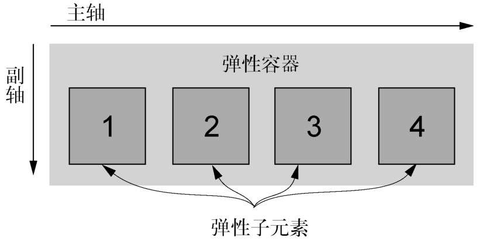
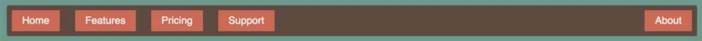
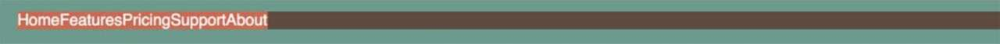
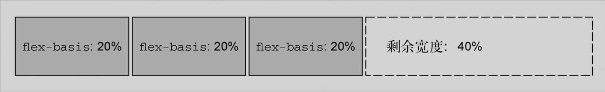
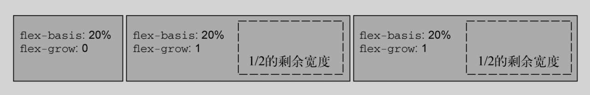
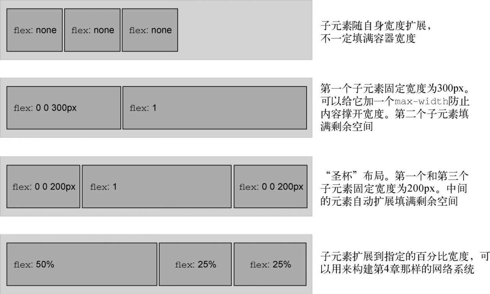
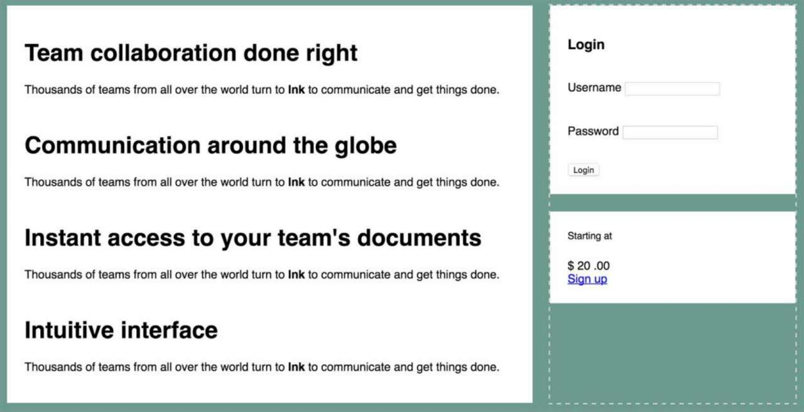
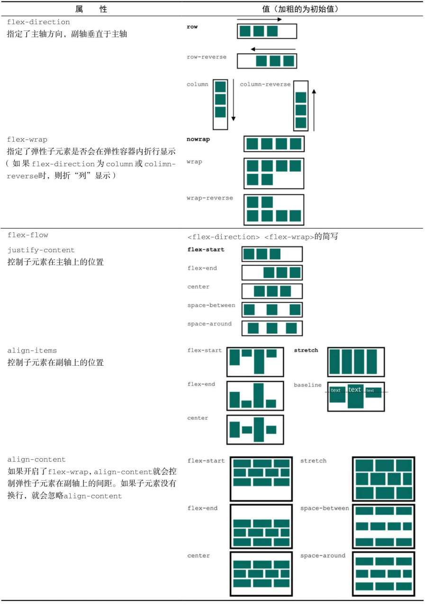
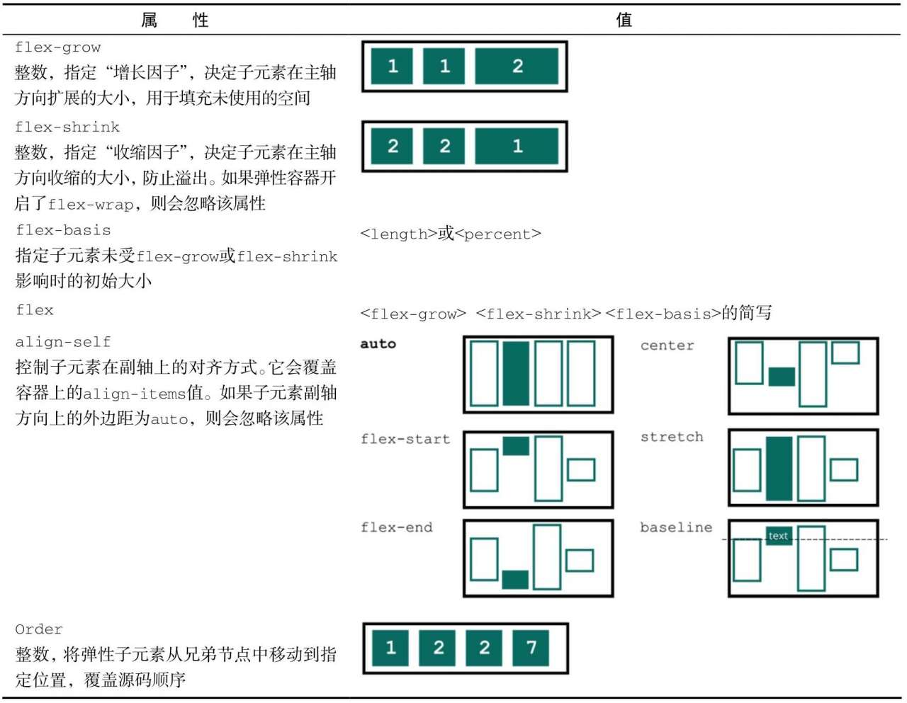

#### Flexbox 的原则

给元素添加 `display:flex` , 该元素变成了一个==弹性容器==, 它的直接元素变成了==弹性子元素==. 弹性子元素默认是在同一行按照从左到右的顺并拍排列. 弹性容器像块元素一样填满可用宽度, 但是弹性元素不一定填满其弹性容器的宽度. 弹性子元素的高度相等, 该高度由它们的内容决定.

之前提到的 `display` 值, 例如 `inline` 、 `inline-block` 等, 只会影响到应用了该样式的元素, 而 Flexbox 则不一样. 一个弹性容器能控制内部元素的布局.



子元素按照主轴线排列, 主轴的方向为主起点(左)到主终点(右). 垂直于主轴的是副轴. 方向从副起点(上)到副终点(下). 这些轴的方向可以改变.



如要实现上图的菜单, 需要考虑让哪个元素做弹性容器, 这个元素的子元素就会成为弹性子元素. 在这里弹性容器应该是 `<ul>` . 它的子元素即列表项 `<li>` 就是弹性子元素.

```HTML
<ul class="site-nav">
    <li><a href="/">Home</a></li>
    <li><a href="/features">Features</a></li>
    <li><a href="/pricing">Pricing</a></li>
    <li><a href="/support">Support</a></li>
    <li class="nav-right">
        <a href="/about">About</a>
    </li>
</ul>
```

然后分几步构建这个菜单:

首先列表加上 `display:flex` .

```CSS
.site-nav {
    /* 指定为弹性容器，让子元素成为弹性子元素 */
    display: flex;
    padding-left: 0;
    background-color: #5f4b44;
    list-style-type: none;
}

.site-nav>li {
    margin-top: 0;
}

.site-nav>li>a {
    background-color: #cc6b5a;
    color: white;
    text-decoration: none;
}
```



加上内边距让其变得更饱满:

在这个例子里, 应当把菜单项内边距加到内部的 `<a>` 元素上, 而不是 `<li>` 元素上. 因为==整个点击区域的外观和行为应当都符合用户对一个菜单链接的预期==, 而链接的行为来自于 `<a>` 元素, 所以如果把 `<li>` 做成一个好看的大按钮, 里面只有很小的区域( `<a>` )可以点击, 就不符合用户预期.

```CSS
.site-nav {
    display: flex;
    padding: .5em;
    background-color: #5f4b44;
    list-style-type: none;
    border-radius: .2em;
}

.site-nav>li {
    margin-top: 0;
}

.site-nav>li>a {
    /* 让链接成为块级元素，这样就能撑开父元素的高度 */
    display: block;
    padding: .5em 1em;
    background-color: #cc6b5a;
    color: white;
    text-decoration: none;
}
```

注意这里的链接被设置为块级元素. ==如果链接还是行内元素, 那么它给父元素贡献的高度会根据行高计算, 而不是根据内边距和内容==, 这样不符合预期. 另外, 这里给水平方向设置的内边距比垂直方向的要多一点, 因为从美学上来讲这样更让人愉悦.

给菜单项之间添加间隔, 常规的外边距就能做到这一点. 但是 Flexbox 还允许使用 `margin:auto` 来填充弹性子元素之间的可用空间, 还允许将最后的菜单项移动到右侧.

```CSS
.site-nav>li+li {
    margin-left: 1.5em;
}

.site-nav>.nav-right {
    margin-left: auto;
}
```

这里给每个菜单的子元素之间加上了外边距, 最外侧的两个元素除外. 同时给最后一个按钮加上 `auto` 的左侧外边距, 这样就会让和这个外边距填充所有可用空间, 最后的按钮就会被推到最右侧.

这里只给最后一个元素 `About` 加了 `auto` 外边距. 如果希望将 `Support` 菜单项和 `About` 菜单项就推到右侧, 则可以把 `auto` 外边距移到 `Support` 菜单栏上.

#### 弹性子元素的大小

上面的代码使用外边距给弹性元素设置了间距. 可以用 `width` 和 `height` 属性设置大小, 但是比起 `margin` 、 `width` 、 `heigth` 这些常见属性, `Flexbox` 提供了更多更强大的选项. 例如 `flex` .

`flex` 属性控制弹性子元素在主轴方向上的大小(这里指元素的宽度).

```HTML
<main class="flex">
    <div class="column-main tile">
        <h1>Team collaboration done right</h1>
        <p>Thousands of teams from all over the
            world turn to <b>Ink</b> to communicate
            and get things done.</p>
    </div>
    <div class="column-sidebar">
        <div class="tile">
            <form class="login-form">
                <h3>Login</h3>
                <p>
                    <label for="username">Username</label>
                    <input id="username" type="text" name="username" />
                </p>
                <p>
                    <label for="password">Password</label>
                    <input id="password" type="password" name="password" />
                </p>
                <button type="submit">Login</button>
            </form>
        </div>
        <div class="tile centered">
            <small>Starting at</small>
            <div class="cost">
                <span class="cost-currency">$</span>
                <span class="cost-dollars">20</span>
                <span class="cost-cents">.00</span>
            </div>
            <a class="cta-button" href="/pricing">
                Sign up
            </a>
        </div>
    </div>
</main>
```

这里给网页的主区域应用弹性布局, 并使用 `flex` 属性控制每一列的大小.

```CSS
.tile {
    padding: 1.5em;
    background-color: #fff;
}

.flex {
    /* 将主容器设置为Flexbox */
    display: flex;
}

.flex>*+* {
    /* 去掉顶部外边距，给每个弹性元素之间加上间隔 */
    margin-top: 0;
    margin-left: 1.5em;
}
```

现在内容已经分为了两列: 左侧较大的区域是网页的主要内容, 右侧是登录表单和一个小的价格盒子. 因为目前还没有特别设置两列的宽度, 所以是==根据内容自适应的宽度==.

弹性子元素的 `flex` 属性其实包含了好几个选项. 这里通过 `column-main` 和 `colunm-sidebar` 类来指定两列, 使用 `flex` 属性给两列分别赋以 `2/3` 和 `1/3` 的宽度:

```CSS
.column-main {
    flex: 2;
}

.column-sidebar {
    flex: 1;
}
```

现在两列扩展宽度填满空间, 它们的宽度加起来等于 `nav` 导航条的宽度, 同时左侧主区域的宽度是侧边栏宽度的两倍. Flexbox 已经完成了所有数学计算.

`flex` 属性是三个不同大小属性的简写: `flex-grow` 、 `flex-shrink` 和 `flex-basis` . 上面的代码里只提供了一个 `flex-grow` 值, 剩下两个属性是默认值(分别是 1 和 0%), 因此 `flex: 2` 等价于 `flex: 2 1 0%` . 也可以分别声明三个属性.

##### flex-basis

`flex-basis` 定义了元素大小的基准值, 即一个初始的"主尺寸". `flex-basis` 属性可以设置为任意的 `width` 值, 包括 `px` 、 `em` 、 百分比. 它的初始值是 `auto` , 此时浏览器会检查元素是否设置了 `width` 的属性值. 如果有, 则使用 `width` 的值作为 `flex-basis` 的值, 如果没有, 则用==元素内容自身的大小==. 

如果 `flex-basis` 的值不是 `auto` , `width` 属性会被忽略.



上图是那个弹性子元素的弹性基准是 20%, 每一个元素初始主尺寸(宽度)为 20%.

每个弹性子元素的初始主尺寸确定后, 它们可能需要在主轴方向扩大或者缩小来适应(或者填充)弹性容器大小. 这时候就需要 `flex-grow` 和 `flex-shrink` 来决定缩放的规则.

##### flex-grow

每个弹性子元素的 `flex-basis` 值计算出来后, 它们(加上子元素之间的外边距)加起来会占据一定的宽度. 加起来的宽度不一定会正好填满弹性容器的宽度, 可能会有留白. 

多出来的留白(或剩余宽度)会按照 `flex-grow` (增长因子)的值分配给各个弹性子元素, `flex-grow` 的值为==非负整数==. 如果一个弹性子元素的 `flex-grow` 的值为0, 那么它的宽度不会超过 `flex-basis` 的值; 如果某个弹性子元素的增长因子非 0, 那么这些元素会增长到所有的剩余空间被分配完, 也就意味着弹性子元素会填满容器的宽度.



`flex-grow` 的值越大, 元素的权重越高, 也就会占据更大的剩余宽度. 一个 `flex-grow:2` 的子元素增长的宽度为 `flex-grow: 1` 的子元素的两倍.

##### flex-shrink

`flex-shrink` 属性与 `flex-grow` 遵循相似的规则. 计算出弹性子元素的初始主尺寸之后, 它们的累加值可能会超出弹性容器的可用宽度. 如果不用 `flex-shrink` , 就会导致溢出.


每个子元素的 `flex-shrink` 值代表了它是否应该收缩以防止溢出. 如果某个子元素为 `flex-shrink:0` , 则会收缩至不再溢出. 按照 `flex-shrink` 的比例, 值越大的元素收缩得越多.

用 `flex-shrink` 也能实现上述页面中两列的宽度. 首先将两列的 `flex-basis` 指定为理想的比例(66.7% 和 33.3%). 它们它的宽度加上 `1.5em` 的间隔就会比容器宽度多出 `1.5em` . 然后将两列的 `flex-shrink` 设置为 1, 这样就会从每列的宽度减去 `0.75em` , 于是容器就能容纳两列了.

```CSS
.column-main {
    /* 等价于 flex: 1 1 66.7% */
    flex: 66.7%;
}

.column-main {
    /* 等价于 flex: 1 1 33.3% */
    flex: 33.3%;
}
```

`flex` 属性有很多用法. 不仅可以像上面网页那样, 用 `flex-basis` 值或者 `flex-basis` 百分比定义每列的比例. 也可以用于定义固定宽度的列和随着视口缩放的"流动"列. 还可以用 Flexbox 而不是浮动构建网格系统.



#### 弹性方向

Flexbox 的另一个重要功能是能够切换主副轴方向, 用弹性容器的 `flex-diretion` 属性控制. 它的初始值 `row` 控制子元素按从左到右的方向排列; 指定 `flex-direction: column` 能控制弹性子元素沿垂直方向排列(从上到下). `row-reserve` 让元素从右往左排列, `column-reverse` 让元素从下到上排列.


改变弹性方向就改变了主轴方向, 副轴因为要与主轴垂直, 所以方向也会随之改变.

上面的网页中如果给 `cloumn-main` 添加一些标题和段落, 就会发现主板块超出了右边板块的底部.



打开开发者选项, 可以看到其实左右两个弹性子元素是等高的. 问题是右边栏内部的两个板块没有扩展到填满右边栏区域.

可以将右边栏改为弹性容器, 并设置 `flex-direction: column` . 然后给里面的两个板块设置非 `0` 的 `flex-grow` 值:

```CSS
.column-sidebar {
    /* 对外面的弹性盒子来说它是弹性子元素 */
    /* 对内部的元素而言是弹性容器 */
    flex: 1;
    display: flex;
    flex-direction: column;
}

.column-sidebar>.tile {
    flex: 1;
}
```

内部的弹性盒子的弹性方向为 `column` , 因此主轴发生了旋转, 现在变成了从上到下(副轴变成了从左到右). 也就是对于弹性子元素而言, `flex-basis` 、 `flex-grow` 和 `flex-shrink` 现在作用于元素的高度而不是宽度. 并且由于制定了 `flex:1` , 因此在必要的时候子元素的高度会扩展到填满容器. 无论哪边更高, 主板块的底部和右边第二个小板块的底部都会对齐.

水平弹性盒子的大部分概念同样适用于垂直的弹性盒子( `column` 或 `column-reverse` ), 但是有一点不同:==在 css 中处理高度的方式与处理宽度的方式在本质上不一样. 弹性容器会占据 100% 的可用宽度, 而高度则由自身的内容来决定. 即使改变主轴方向, 也不会影响这一本质.==

弹性容器的高度由弹性子元素决定, 它们会正好填满容器. 在垂直的弹性盒子里, 子元素的 `flex-grow` 和 `flex-shrink` 不会起作用, 除非有"外力"强行改变容器的高度, 在这里, "外力"就是从外层盒子计算出来的高度.

#### 对齐、 间距等细节

通常情况下, 创建一个弹性盒子需要用到前面提及的这些方法:

* 选择一个容器及其子元素, 给容器设置`display: flex`; 
* 如有必要, 给容器设置`flex-direction`; 
* 给弹性元素设置外边距和/或`flex`值, 用来控制它们的大小.




