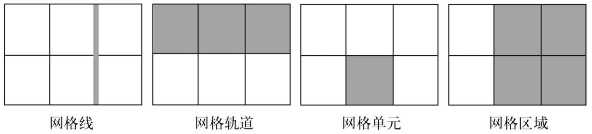
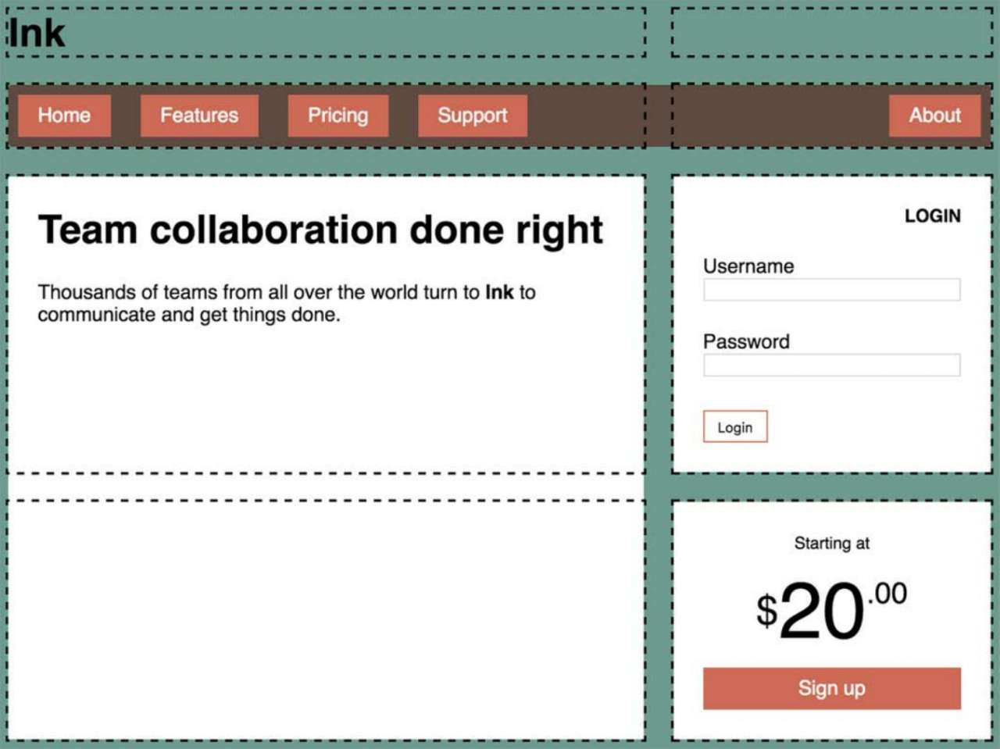
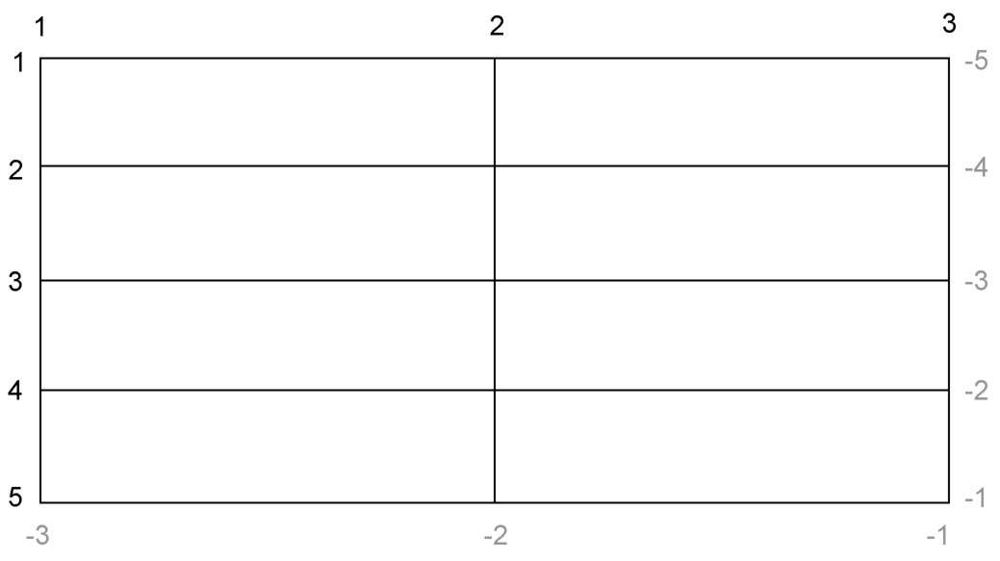
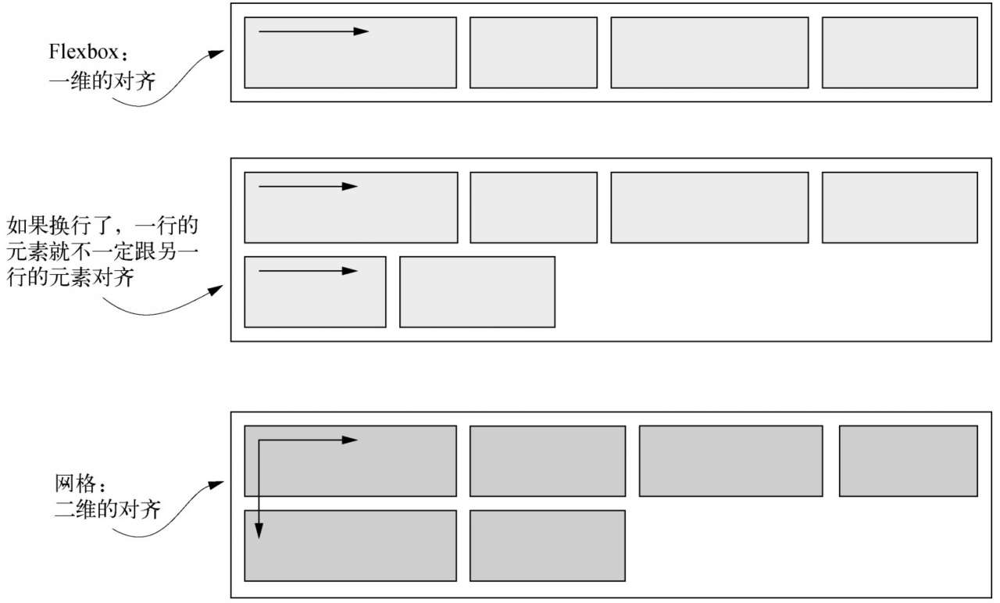
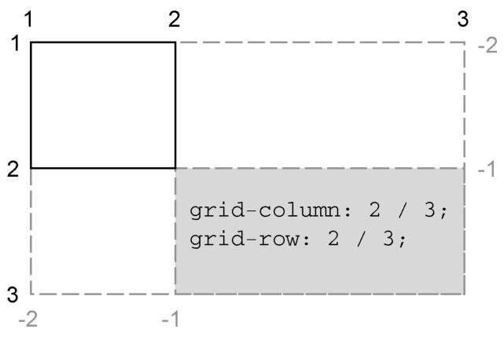
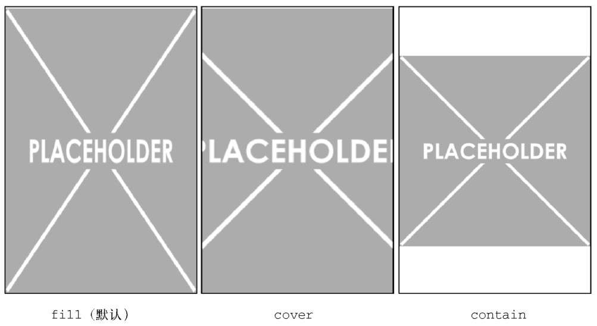
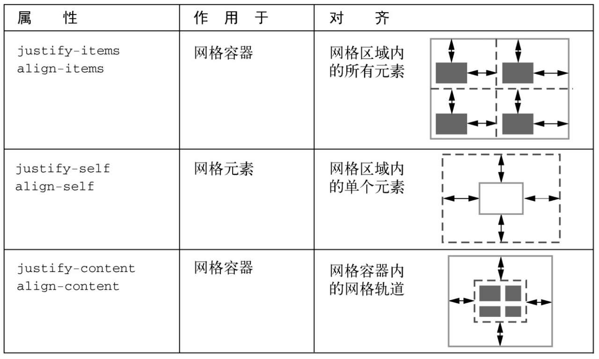

#### 基础网格

例如将6个盒子放在3列中:

```HTML
  <div class="grid">
      <div class="a">a</div>
      <div class="b">b</div>
      <div class="c">c</div>
      <div class="d">d</div>
      <div class="e">e</div>
      <div class="f">f</div>
  </div>
```

与 Flexbox 类似, 网页布局也是作用域两级的 DOM 结构. 设置为 `display:grid` 的元素成为一个==网格容器==, 它的子元素则变成==网格元素==.

```CSS
.grid {
    display: grid;
    grid-template-columns: 1fr 1fr 1fr;
    grid-template-rows: 1fr 1fr;
    grid-gap: 0.5em;
}

.grid>* {
    background-color: darkgray;
    color: white;
    padding: 2em;
    border-radius: 0.5em;
}
```

首先使用 `display: grid` 定义一个网格容器. 容器会表现得像一个块级元素, 100% 填充可用宽度.

`grid-template-columns` 和 `grid-template-rows` 定义了网格每行每列的大小. 这里使用了一种新单位 `fr` , 代表每一列或每一行的==分数单位==. 这个单位跟 Flexbox 中的 `flex-grow` 因子的表现一样. `grid-template-columns: 1fr 1fr 1fr` 表示三列等宽. 也可以使用其他单位或者混搭几种单位, 在减去其他单位的宽度之后, `fr` 单位会填满剩余可用空间的列.

最后, `grid-gap` 属性定义了每个网格单元之间的间距, 也可以用两个值分别指定垂直和水平方向的间距(例如 `grid-gap:0.5em 1em` ).

#### 网格剖析

网格中有4个重要概念:

* 网格线: 网格线构成了网格的框架. 一条网格线可以水平或垂直, 并且位于一行或一列的任意一侧. 如果制定了`grid-gap`的话, 它就位于网格线上.
* 网格轨道: 一个网格轨道是两条相邻网格线之间的空间. 网格有水平轨道(行)和垂直轨道(列).
* 网格单元: 网格上的单个空间, 水平和垂直的网格轨道交叉重叠的部分.
* 网格区域: 网格上的矩形区域, 由一个到多个网格单元组成, 该区域位于两条垂直网格线和两条水平网格线之间.



对于之前 Flexbox 中的例子, 可以用网格来实现:



这个网格有两列和四行. 每个网格元素必须是网格容器的子元素.

```HTML
<div class="container">
    <header>
        ...
    </header>
    <nav>
        ...
    </nav>
    <main class="main tile">
        ...
    </main>
    <div class="sidebar-top tile">
        ...
    </div>
    <div class="sidebar-bottom tile centered">
        ...
    </div>
</div>
```

```CSS
:root {
    box-sizing: border-box;
}

*,
::before,
::after {
    box-sizing: inherit;
}

body {
    background-color: #709b90;
    font-family: Helvetica, Arial, sans-serif;
}

.container {
    display: grid;
    grid-template-columns: 2fr 1fr;
    grid-template-rows: repeat(4, auto);
    grid-gap: 1.5em;
    max-width: 1080px;
    margin: 0 auto;
}

header,
nav {
    grid-column: 1 / 3;
    grid-row: span 1;
}

.main {
    grid-column: 1 / 2;
    grid-row: 3 / 5;
}

.sidebar-top {
    grid-column: 2 / 3;
    grid-row: 3 / 4;
}

.sidebar-bottom {
    grid-column: 2 / 3;
    grid-row: 4 / 5;
}

.tile {
    padding: 1.5em;
    background-color: #fff;
}

.tile> :first-child {
    margin-top: 0;
}

.tile *+* {
    margin-top: 1.5em;
}
```

这里首先设置了网格容器, 并用 `grid-template-columns` 和 `grid-template-rows` 定义了网格轨道. 这里用到了一个新方法 `repeat()` 函数. 它在声明多个网格轨道的时候提供了简写方式.

`grid-template-rows: repeat(4, auto); ` 定义了四个水平网格轨道, 高度为 `auto` , 这等价于 `grid-template-rows: auto auto auto auto; ` , 轨道大小设置为 `auto` , 轨道会根据自身内容扩展.

##### 网格线的编号

网格轨道定义好之后, 要将每个网格元素放到特定的位置上. 浏览器给网格里的每个网格线都赋予了编号:



可以在 `grid-column` 和 `grid-row` 属性中用网格线的编号指定网格元素的位置. 如果想要一个网格元素在垂直方向上跨域1号网格线到3号网格线, 就可以设置为 `grid-column:1/3` .

这两个属性实际上是简写属性. `grid-column` 是 `grid-column-start` 和 `grid-column-end` 的简写; `grid-row` 是 `grid-row-start` 和 `grid-row-end` 的简写. 中间的斜线只在简写属性里用于区分两个值, 斜线前后的空格不做要求.

还可以使用一个特别的关键字 `span` 来指定 `grid-row` 和 `grid-column` 的值, 例如 `grid-row: span 1` . 这个关键字告诉浏览器元素需要占据一个网格轨道. 因为这里没有指出具体是哪一行, 所以会根据网格元素的==布局算法==自动将其放到合适的位置. 布局算法会将元素放在网格上可以容纳该元素的第一处可用空间.

##### 网格与 Flexbox

网格与 Flexbox 是互补的. 他们有两个重要区别:

* Flexbox 本质上是一维的, 而网格是二维的.
* Flexbox 是以内容为切入点由内向外工作的, 而网格是以布局为切入点从外向内工作的.

因为 Flexbox 是一味的, 所以它很适合用在相似的元素组成的行(列)上. 它支持用 `flex-wrap` 换行, 但是无法让上一行元素跟下一行元素对齐. 而网格是二维的, 旨在解决一个轨道的元素跟另一个轨道的元素对齐的问题.



在网格中, 首先要描述布局, 然后将元素放到布局结构中去. 虽然每个网格元素的内容都能影响其网格轨道的大小, 但是这同时也会影响整个轨道的大小, 进而影响这个轨道里的其他网格元素的大小.

用网格给网页的主区域定位是因为我们希望内容能限制在它所在的网格内, 但是对于网页上的其他元素, 比如导航菜单, 则允许内容对布局有更大的影响. 也就是说文字多的元素可以宽一些, 文字少的元素则可以窄一些.

所以当一般设计要求元素在两个维度上都对齐时, 使用网格. 当只关心一维的元素排列时使用 Flexbox.

##### 网格线命名

在处理很多网格轨道时, 为了简单点可以给我网格线命名, 并在布局时使用网格线的名称而不是编号. 声明网格轨道时, 可以在中括号内写上网格线的名称:

```CSS
grid-template-columns:[start] 2fr [center] 1fr [end];
```

这条声明定义了两列的网格, 三条垂直的网格线分别叫作 `start` 、 `center` 和 `end` . 之后定义网格元素在网格中的位置时, 可以不用编号而是用这些名称来声明:

```CSS
grid-column: start / center;
```

还可以给同一个网格线提供多个名称:

```CSS
grid-template-columns: [left-start] 2fr [left-end right-start] 1fr [right-end];
```

这里的2号网格线既叫作 `left-end` 也叫作 `right-start` , 可以任选一个名称使用. 这里将网格线命名为 `left-start` 和 `left-end` , 就定义了一个叫作 `left` 的区域. `-start` 和 `-end` 后缀作为关键字, 定义了两者之间的区域. 如果给元素设置 `grid-column: left` , 它就会跨域从 `left-start` 到 `left-end` 的区域.

还可以用 `repeat()` 重复使用同一个名称:

```CSS
grid-template-columns: repeat(4, [row] auto)
```

这样就可以用 `row 3` 来表示第三个名为 `row` 的网格线.

##### 网格区域命名

也可以给网格区域命名. 不用计算或者命名网格线, 直接用命名的网格区域将元素定位到网格中. 实现这一方法需要借助网格容器的 `grid-template-areas` 属性和网格元素的 `grid-areas` 属性.

```CSS
.container {
    display: grid;
    grid-template-areas: "title title"
        "nav   nav"
        "main  aside1"
        "main  aside2";
    grid-template-columns: 2fr 1fr;
    grid-template-rows: repeat(4, auto);
    grid-gap: 1.5em;
    max-width: 1080px;
    margin: 0 auto;
}

header {
    grid-area: title;
}

nav {
    grid-area: nav;
}

.main {
    grid-area: main;
}

.sidebar-top {
    grid-area: aside1;
}

.sidebar-bottom {
    grid-area: aside2;
}
```

在这里 `grid-template-areas` 属性使用了一种 ACII art 的语法, 可以直接在 CSS 中画一个可视化的网格形象, 该声明给出了一些列加引号字符串. 每一个字符串代表网格的一行, 字符串用空格区分每一列. 再用 `grid-area` 属性将每个网格元素放在这些命名区域中.

每个网格区域必须组成一个矩形, 可以用句点 `.` 作为名称, 这样就能空出一个网格单元.

#### 显式和隐式网格

在某些场景下可能不清楚该把元素放在网格的哪个位置上. 例如处理大量的网格元素或元素是从数据库获取且数量未知时. 在这些情况下, 以一种宽松的方式定义网格更合理, 剩下的交给布局算法来放置网格元素.

这时需要用到==隐式网络==. 使用 `grid-template-*` 属性定义网格轨道时创建的是==显式网格==, 但是有些元素仍然可以放在显式轨道外面, 此时会自动创建隐式轨道以扩展网格, 从而包含这些元素.



上图只在每个方向上指定了一个网格轨道. 当吧元素放在第二个轨道(2号和3号网格线之间)时, 就会自动创建轨道来包含该元素.

隐式网格轨道默认大小为 `auto` , 也就是它们会扩展到能容纳网格元素内容. 可以给网格容器设置 `grid-auto-colunms` 和 `grid-auto-rows` 为隐式网格轨道指定一个大小.

在指定网格线的时候隐式网格轨道不会改变负数的含义, 负的网格线编号仍然是从显式网格的右下开始的.

例如要实现一个照片墙:


```HTML
<div class="portfolio">
    <figure class="featured">
        
        <figcaption>Monkey</figcaption>
    </figure>
    <figure>
        
        <figcaption>Eagle</figcaption>
    </figure>
    <figure class="featured">
        
        <figcaption>Bird</figcaption>
    </figure>
    <figure>
        
        <figcaption>Bear</figcaption>
    </figure>
    <figure class="featured">
        
        <figcaption>Swan</figcaption>
    </figure>
    <figure>
        
        <figcaption>Elephants</figcaption>
    </figure>
    <figure>
        
        <figcaption>Owl</figcaption>
    </figure>
</div>
```

先创建网格轨道:

```CSS
:root {
    box-sizing: border-box;
}

*,
::before,
::after {
    box-sizing: inherit;
}

body {
    background-color: #709b90;
    font-family: Helvetica, Arial, sans-serif;
}

.portfolio {
    display: grid;
    /* 将最小列宽设置为200px，自动填充网格 */
    grid-template-columns: repeat(auto-fill, minmax(200px, 1fr));
    /* 将隐式水平网格轨道的大小设置为 1fr */
    grid-auto-rows: 1fr;
    grid-gap: 1em;
}

.portfolio>figure {
    margin: 0;
}

.portfolio img {
    max-width: 100%;
}

.portfolio figcaption {
    padding: 0.3em 0.8em;
    background-color: rgba(0, 0, 0, 0.5);
    color: #fff;
    text-align: right;
}
```

这里使用 `grid-auto-rows` 为所有的隐式网络行指定一个 `1fr` 的大小.

有时候我们不想给一个网格轨道设置固定尺寸, 但是又希望限制它的最小值和最大值. 这时候需要用到 `minmax()` 函数. 它指定两个值: 最小尺寸和最大尺寸. 浏览器会确保网格轨道的大小介于这两者之间. 通过 `minmax(200px, 1fr)` , 浏览器确保了所有的轨道至少宽 `200px` .

`repeat` 函数里的 `auto-fill` 关键字是一个特殊值. 设置了之后, 浏览器就会尽可能多的生成轨道, 并且不会跟指定大小( `minmax()` 值)的限制产生冲突.

`auto-fill` 和 `minmax(200px, 1fr)` 加在一起, 就会让网格在可用的空间内尽可能多地产生网格列, 并且每个列的宽度不会小于 `200px` . 因为所有轨道的大小上限都为 `1fr` , 所以所有的网格轨道都等宽.

如果网格元素不够填满所有网格轨道, `auto-fill` 就会导致一些空的网格轨道. 如果不希望出现空的空格轨道, 可以使用 `auto-fit` 关键字代替 `auto-fill` , 它会让非空的网格轨道扩展, 填满可用空间.

现在所有网格元素都只占据了1x1的区域, 可以用 `featured` 类选择某些元素让它们在水平和垂直方向都占据两个网格轨道.

但是由于元素按顺序排列增加某些网格元素的大小会导致网格中出现空白区域.

当不指定网格上元素的位置时, 元素会按照其布局算法自动放置. 默认情况下, 布局算法会按元素在标记中的顺序将其逐列逐行摆放. 当一个元素无法在某一行容纳(也就是说该元素占据了太多网格轨道)时, 算法会将它移动到下一行, 寻找足够大的空间容纳它.


网格布局模块规范提供了另一个属性 `grid-auto-flow` , 它可以控制布局算法的行为. 它的初始值是 `row` , 上一段描述的就是这个值的行为. 如果值为 `column` , 它就会将元素优先放在网格列中, 只有当一列填满了, 才会移动到下一行.

还可以额外加一个关键字 `dense` (比如, `grid-auto-flow:column dense` ). 它让算法紧凑地填满网格里的空白, 尽管这会改变某些网格元素的顺序. 加上这个关键字, 小元素就会"==回填=="大元素造成的空白区域.


```CSS
.portfolio {
    display: grid;
    grid-template-columns: repeat(auto-fill, minmax(200px, 1fr));
    grid-auto-rows: 1fr;
    grid-gap: 1em;
    /* 开启紧凑的网格布局算法 */
    grid-auto-flow: dense;
}

.portfolio .featured {
    /* 放大特定图片，变成2x2 */
    grid-row: span 2;
    grid-column: span 2;
}
```

这里的 `grid-auto-flow: dense` 等价于 `grid-auto-flow: row dense` , 因为它的初始值就是 `row` . 这里只使用了 `span` 关键字, 没有明确地将任何一个网格元素放到某个网格轨道上. 这样布局算法就会将网格元素放到它觉得合适的地方.

但是但现在较大的图片还没有完全填满网格单元, 在图片下面留了一片空白. 理想情况下, 每个元素的顶部和底部都应该跟同一网格轨道上的元素对齐.

一个简单的解决办法是用 Flexbox. 但是拉伸图片并不可取, 因为这会改变图片的宽高比, 导致图片变形. 好在 CSS 为控制这一行为提供了一个特殊属性 `object-fit` . 默认情况下, 一个 `` 的 `object-fit` 属性值为 `fill` , 也就是说整个图片会缩放, 以填满 `` 元素. 也可以设置其他值改变默认行为.

比如, `object-fit` 属性的值还可以是 `cover` 和 `contain` . 这些值告诉浏览器, 在渲染盒子里改变图片的大小, 但是不要让图片变形.
* `cover`: 扩展图片, 让它填满盒子(导致图片一部分被裁剪).
* `contain`: 缩放图片, 让它完整地填充盒子(导致盒子里出现空白).



```CSS
.portfolio>figure {
    display: flex;
    flex-direction: column;
    margin: 0;
}

.portfolio img {
    flex: 1;
    object-fit: cover;
    max-width: 100%;
}
```

#### 对齐

CSS给网格布局提供了三个调整属性: `justify-content` 、 `justify-items` 、 `justify-self` . 这些属性控制了网格元素在==水平==方向上的位置. 就像在文字处理器里调整文字位置, 让它们在水平方向上分布.
还有三个对齐属性: `align-content` 、 `align-items` 、 `align-self` . 这些属性控制网格元素在==垂直==方向上的位置. 我是这样记的: 就像表格布局里的 `vertical-align` 属性.



例如:

```CSS
.grid {
    display: grid;
    height: 1200px;
    grid-template-rows: repeat(4, 200px);
}
```

它明确指定了网格容器的高度为 `1200px` , 但是只定义了高 `800px` 的有效水平网格轨道. `align-content` 属性指定了网格轨道如何在剩下的 `400px` 空间内分布. 它可以设为以下值:
* `start`: 将网格轨道放到网格容器的上/左( Flexbox 里则是`flex-start`).
* `end`: 将网格轨道放在网格容器的下/右(Flexbox 里则是`flex-end`).
* `center`: 将网格轨道放在网格容器的中间.
* `stretch`: 将网格轨道拉伸至填满网格容器.
* `space-between`: 将剩余空间平均分配到每个网格轨道之间(它能覆盖任何`grid-gap`值).
* `space-around`: 将空间分配到每个网格轨道之间, 且在两端各加上一半的间距.
* `space-evenly`: 将空间分配到每个网格轨道之间, 且在两端各加上同等大小的间距(Flexbox 规范不支持).
