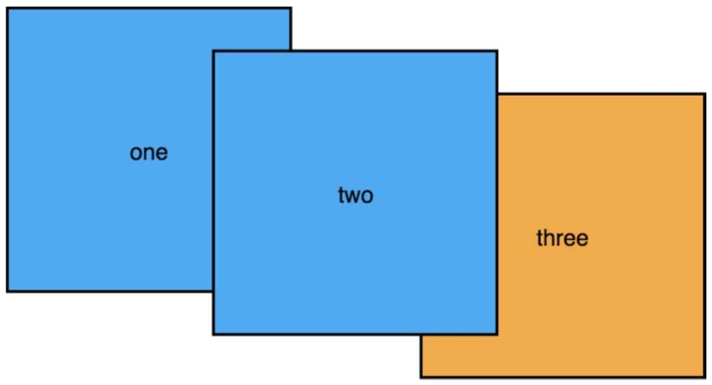

#### 固定定位

固定定位让元素相对视口定位, 此时视口被称作元素的包含块.

给一个元素设置 `position:fixed` 就能将元素放在任意位置. 使用 `top` 、 `right` 、 `bottom` 、 `left` 可以设置与浏览器视口边缘的距离. 设置这四个值还==隐式地定义了元素的宽高==. 例如 `left: 2em; right: 2em; ` 表示元素的左边缘距离视口左边 `2em` , 右边缘距离视口右边 `2em` , 因此元素的宽度等于视口总宽度减去 `4em` .

因为固定元素从文档流中移除了, 所以它不再影响页面其他元素的位置. 别的元素会跟随正常文档流, 就像固定元素不存在由于, 也就是说它们通常会在固定元素下面排列, 视觉上被遮挡. 而有时候会不想让其他容器出现在它下面, 通常给其他元素加一个外边距就能解决.

#### 绝对定位

绝对定位也有包含块, 但它的包含块不太一样, 它不是相对视口, 而是相对最近的祖先定位元素.

给一个元素设置决定定位之后, 它会向自己的父级元素寻找, 如果父元素被定位了, 父元素就是它的包含块, 如果父元素未被定位, 那么浏览器会沿着 DOM 树网上找它的祖父、 曾祖父, 直到找到一个定位元素, 用它作为包含块. 如果祖先元素都没有定位, 那么绝对定位的元素会基于==初始包含块==来定位, 它跟视口一样大, 固定在网页的顶部.

例如将一个文字为 `close` 的按钮换成 `x` , 可以用 CSS 隐藏 `close` , 并显示 `x` . 首先将按钮的文字挤到外面, 并隐藏溢出内容, 然后将按钮的 `::after` 伪元素的 `content` 属性设置为 `x` , 并让伪元素绝对定位到按钮中间.

```CSS
.modal-close {
    position: absolute;
    top: 0;
    right: 0;
    padding: 0.3em;
    font-size: 2em;
    height: 1.5em;
    width: 1.5em;
    cursor: pointer;
    border: 0;
}

.modal-close::before {
    display: block;
    content: '\00D7';
}
```

#### 相对定位

相对定位的元素以及它周围的所有元素, 几乎都还保持着原来的位置. 如果加上 `top` 、 `right` 、 `bottom` 、 `left` 属性, 元素就会从原来的位置移走, 但是不会改变它周围任何元素的位置.


例如给上图第二个元素加上相对定位, 并且设置位置, 将其从初始位置移走, 其他元素并没有受到影响. 它们还是围绕着被移走元素的初始位置, 跟随正常的文档流.

相对定位可能导致元素跟它下面或者旁边的元素重叠. 在相对定位中也可以使用负值. 例如 `bottom: -1em` 也可以像 `top: 1em` 那样将元素向下移动 `1em` .

跟固定或者绝对定位不一样, 不能用 `top` 、 `right` 、 `bottom` 和 `left` 改变相对定位元素的大小. 这些值只能让元素在上、 下、 左、 右方向移动. 可以用 `top` 或者 `bottom` , 但它们不能一起用( `bottom` 会被忽略). 同理, 可以用 `left` 或 `right` , 但它们也不能一起用( `right` 会被忽略).

相对定位最常见的用法是用来给它内部的绝对定位元素创建一个包含块. 例如用相对定位和绝对定位创建一个下拉菜单:

```HTML
 <div class="container">
     <nav>
         <div class="dropdown">
             <div class="dropdown-label">Main Menu</div>
             <div class="dropdown-menu">
                 <ul class="submenu">
                     <li><a href="/">Home</a></li>
                     <li><a href="/coffees">Coffees</a></li>
                     <li><a href="/brewers">Brewers</a></li>
                     <li><a href="/specials">Specials</a></li>
                     <li><a href="/about">About us</a></li>
                 </ul>
             </div>
         </div>··
     </nav>

     <h1>Wombat Coffee Roasters</h1>
 </div>
```

下拉菜单包含两个子元素: 一个始终显示的灰色矩形标签以及一个下拉菜单. 下拉菜单用显示和隐藏表示菜单展开和收起, 因为它会是绝对定位的, 所以当下拉菜单显示时不会改变网页的布局, 这意味着它显示时会出现在其他内容前面.

```CSS
.container {
    width: 80%;
    max-width: 1000px;
    margin: 1em auto
}

.dropdown {
    display: inline-block;
    /* 创建包含块 */
    position: relative;
}

.dropdown-label {
    padding: 0.5em 1.5em;
    border: 1px solid #ccc;
    background-color: #eee;
}

.dropdown-menu {
    /* 最初隐藏菜单 */
    display: none;
    position: absolute;
    left: 0;
    /* 将菜单移动到下拉菜单下面 */
    top: 2.1em;
    min-width: 100%;
    background-color: #eee;
}

.dropdown:hover .dropdown-menu {
    /* 鼠标悬停时显示菜单 */
    display: block;
}

.submenu {
    padding-left: 0;
    margin: 0;
    list-style-type: none;
    border: 1px solid #999;
}

.submenu>li+li {
    border-top: 1px solid #999;
}

.submenu>li>a {
    display: block;
    padding: 0.5em 1.5em;
    background-color: #eee;
    color: #369;
    text-decoration: none;
}

.submenu>li>a:hover {
    background-color: #fff;
}
```

现在可以用边框画一个三角形当作向下箭头. 这里用标签的 `::after` 伪元素来画三角形, 谈话使用绝对定位将它放到标签的右边.


一个角上两条边的边缘接触的地方会形成一个对角边, 二档元素的宽和高缩小到 0 时:


元素的四周都变成了三角形, 基于这个现象, 可以用一条边作为三角形, 然后将剩下的边设置为透明.

```CSS
.dropdown-label {
    padding: 0.5em 2em 0.5em 1.5em;
    border: 1px solid #ccc;
    background-color: #eee;
}

.dropdown-label::after {
    content: "";
    /* 在标签的右边定位元素 */
    position: absolute;
    right: 1em;
    top: 1em;
    /* 用上边框做一个向下的箭头 */
    border: 0.3em solid;
    border-color: black transparent transparent;
}

.dropdown:hover .dropdown-label::after {
    /* 鼠标悬停时让箭头向上 */
    top: 0.7em;
    border-color: transparent transparent black;
}
```

#### 层叠上下文和 z-index

在同一页面定位多个元素时, 可能会遇到两个不同定位的元素重叠的现象.

##### 渲染过程和层叠顺序

浏览器将 HTML 解析为 DOM 的同时还创建了另一个树形结构, 叫作==渲染树==. 它代表了每个元素的视觉样式和位置. 同时还决定了浏览器绘制元素的顺序. 顺序很重要, 因为如果元素刚好重叠, 后绘制的元素就会出现在先绘制的元素前面.

```HTML
<div>one</div>
<div>two</div>
<div>three</div>
```

如果使用负的外边距让元素重叠但不使用任何定位, 后出现在标记里元素会绘制在先出现的元素前面.


当给元素设置定位时, 这种行为会改变.==浏览器会先绘制所有非定位的元素, 然后绘制定位元素==. 默认情况下, 所有的定位元素会出现在非定位元素前面, 如果给前两个元素添加 `position: relative` , 它们就被绘制到了前面, 覆盖了静态定位的第三个元素, 尽管元素在 HTML 里的顺序并未改变:



所以为了防止设置了固定定位模态框被覆盖, 一个办法是在源码里将它放在最后. 大多数构建模态框的 javaScript 库会自动这么做. 因为模态框使用固定定位, 所以不必关心它的标记出现在哪里, 它会依照定位.

改变固定定位元素的标记位置不会产生不好的影响, 但是对相对定位或绝对定位的元素来说, 通常无法用改变标记位置的方法解决层叠问题. 相对定位依赖于文档流, 绝对定位元素依赖于它的定位祖先节点. 这时候需要用 `z-index` 属性来控制它们的层叠行为.

#### z-index

`z-index` 属性的值可以是任意整数(正负都行). `z` 表示的是笛卡儿 `x-y-z` 坐标系里的深度方向.==拥有较高 `z-index` 的元素出现在拥有较低 `z-index` 的元素前面. 拥有负数 `z-index` 的元素出现在静态元素后面==.

`z-index` 的行为很好理解, 但是使用它时要注意两个小陷阱:
* `z-index`只在定位元素上生效, ==不能用它控制静态元素==.
* 第二, 给一个定位元素加上`z-index`可以创建层叠上下文.

#### 层叠上下文

一个层叠上下文包含一个元素或者由浏览器一起绘制的一组元素. 其中一个元素会作为层叠上下文的根, 比如给一个定位元素加上 `z-index` 的时候, 它就变成了一个新的层叠层叠上下文的根, 它的所有后代元素就是这个层叠上下文的一部分.

层叠上下文和 BFC 是两个独立的概念, 尽管不一定互斥. 层叠上下文负责决定哪些元素出现在另一些元素前面, 而 BFC 负责处理文档流, 以及元素是否会重叠. 实际上将层叠上下文里的所有元素一起绘制会造成严重的后果: 层叠上下文之外的元素无法叠放在层叠上下文内的两个元素之间.

换句话说, 如果一个元素叠放在一个层叠上下文前面, 那么层叠上下文里没有元素可以被拉到该元素前面. 同理, 如果一个元素被放在层叠上下文后面, 层叠上下文里没有元素能出现在该元素后面.

```HTML
<div class="box one positioned">
    one
    <div class="absolute">nested</div>
</div>
<div class="box two positioned">two</div>
<div class="box three">three</div>
```

```CSS
.positioned {
    position: relative;
    background-color: #5ae;
    z-index: 1;
}

.absolute {
    position: absolute;
    top: 1em;
    right: 1em;
    height: 2em;
    background-color: #fff;
    border: 2px dashed #888;
    z-index: 100;
    line-height: initial;
    padding: 1em;
}
```


叠放在第二个盒子后面的第一个盒子是一个层叠上下文的根. 因此, 虽然它的 `z-index` 值很高, 但是它内部的绝对定位元素不会跑到第二个盒子前面.

给一个定位元素加上 `z-index` 是创建层叠上下文最主要的方式, 但还有别的属性也能创建, 比如小于 `1` 的 `opacity` 属性, 还有 `transform` 、 `filter` 属性. 由于这些属性主要会影响元素及其子元素渲染的方式, 因此一起绘制父子元素. 文档根节点( `<html>` )也会给整个页面创建一个顶级的层叠上下文.

所有层叠上下文内的元素会按照以下顺序, 从后到前叠放:
*  层叠上下文的根; 
* `z-index` 为负的定位元素(及其子元素); 
*  非定位元素; 
* `z-index` 为 `auto` 的定位元素(及其子元素); 
* `z-index` 为正的定位元素(及其子元素).

#### 粘性定位

浏览器还提供了一种新的定位类型: 粘性定位, 它是相对定位和固定定位的结合: 正常情况下, 元素会随着页面滚动; 如果用户继续滚动, 它就会锁定在这个位置. 最常见的用例是侧边栏导航.

```HTML
<div class="container">
    <aside class="col-sidebar">
        <div class="affix">
            <ul class="submenu">
                <li><a href="/">Home</a></li>
                <li><a href="/coffees">Coffees</a></li>
                <li><a href="/brewers">Brewers</a></li>
                <li><a href="/specials">Specials</a></li>
                <li><a href="/about">About us</a></li>
            </ul>
        </div>
    </aside>
</div>
```

然后将容器设置为弹性容器:

```CSS
.container {
    display: flex;
    width: 80%;
    max-width: 1000px;
    margin: 1em auto;
    min-height: 100vh;
}

.col-main {
    flex: 1 80%;
}

.col-sidebar {
    flex: 20%;
}

.affix {
    /* 添加粘性定位，它会停在距离视口顶部 1em 的位置 */
    position: sticky;
    top: 1em;
}
```

因为粘性元素永远不会超出父元素的范围, 所这里的 `affix` 不会超出 `col-sidebar` 的范围. 当滚动页面的时候, `col-sidebar` 会一直正常滚动, 但是 `affix` 会在滚动到特定位置时停下来. 如果继续滚动得足够远, 粘性元素还会==恢复滚动==. 这种情况只在==父元素的底边到达粘性元素的底边时==发生. 注意, 只有当父元素的高度大于粘性元素时才会让粘性元素固定, 因此这里我特意给弹性容器加上 `min-height` , 以便让父元素足够高.
