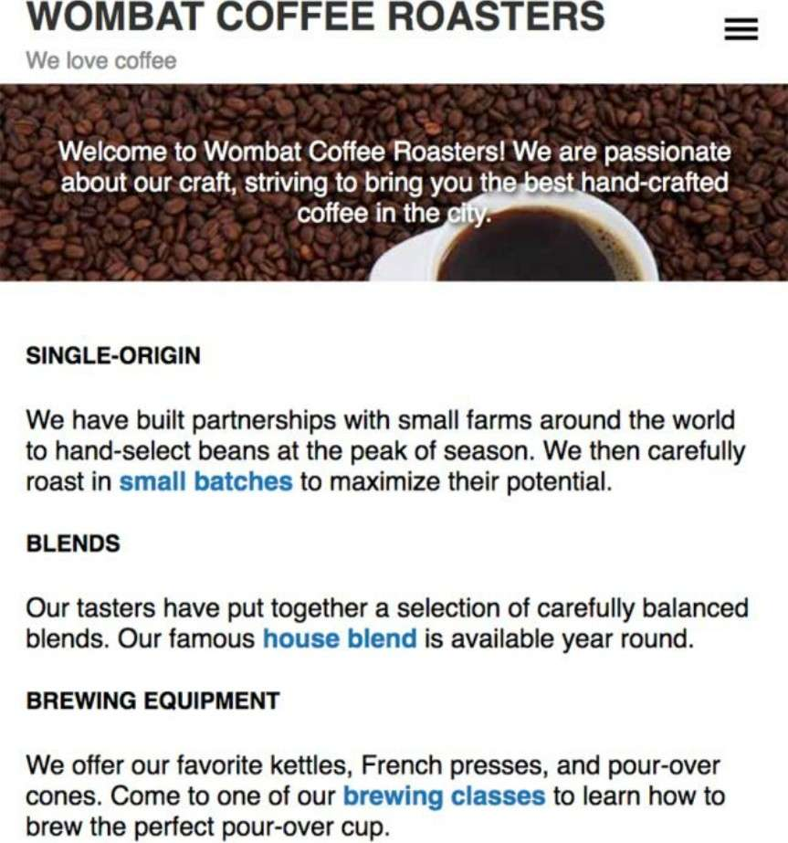
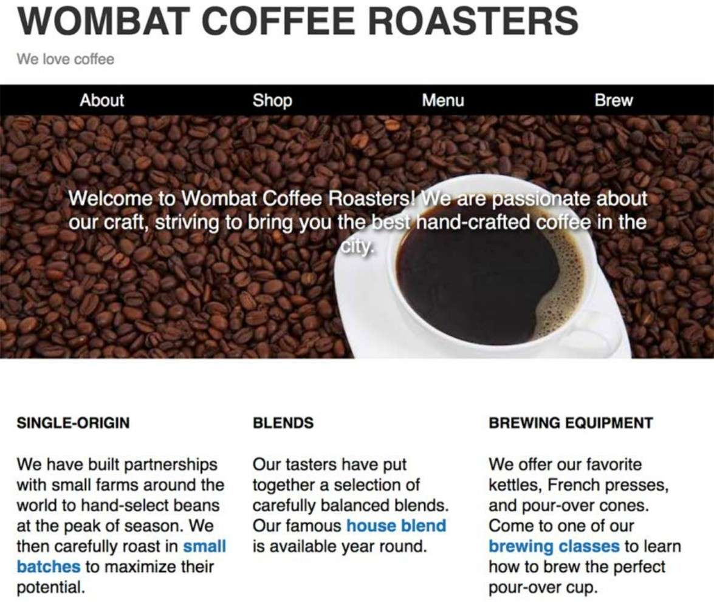
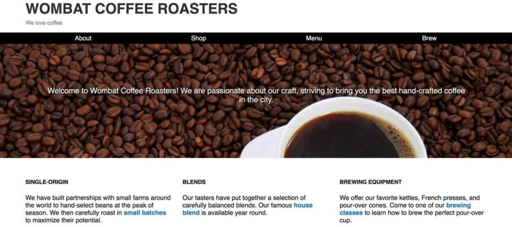

#### 响应式设计

响应式设计的三大原则如下:

* 移动优先. 这意味着在实现桌面布局之前先构建移动版的布局.
* `@media` 规则. 使用这个样式规则, 可以为不同大小的视口定制样式. 用这一语法, 通常叫作媒体查询(mediaqueries), 写的样式只在特定条件下才会生效.
* 流式布局. 这种方式允许容器根据视口宽度缩放尺寸.

#### 移动优先

开发移动版网页有很多限制: 屏幕空间受限、 网络更慢. 用户跟网页交互的方式也不一样: 可以打字, 但是用着很别扭, 不能将鼠标移动到元素上触发效果等. 如果一开始就设计一个包含全部交互的网站, 然后再根据移动设备的限制来制约网站的功能, 那么一般会以失败告终. 

而移动优先的方式则会让你设计网站的时候就一直想着这些限制. 一旦移动版的体验做好了(或者设计好了), 就可以用"渐进增强"(progressive enhancement)的方式为大屏用户增加体验.

除了前面提到的交互菜单, 移动版设计主要关注的是内容. 在大屏上, 可以把页面的大块区域拿来做头部、 主图、 和菜单. 然而在移动设备上, 用户通常有更明确的目标.

例如一个页面在小屏幕、 中等屏幕、 大屏幕下的表现:

小屏幕:




中等屏幕:



大屏幕:



无论样式如何变化, 它们都共享同一份 HTML 代码.

移动版设计中还有一个重要细节, 视口的 `meta` 标签. 这个 HTML 标签告诉移动设备, 页面已经失陪了小屏设备, 如果不加这个标签, 移动浏览器会假定网页不是响应式的, 并且会尝试模拟桌面浏览器.

```HTML
<head>
    <meta charset="UTF-8">
    <meta name="viewport" content="width=device-width, initial-scale=1">
    <title>Wombat Coffee Roasters</title>
    ...
</head>
```

`meta` 标签的 `content` 属性里包含两个选项. 首先告诉浏览器当解析 CSS 时将设备的宽度作为假定宽度, 而不是一个全屏的桌面浏览器的宽度. 其次当页面加载时, 它使用 `initial-scale` 将缩放比例设置为 100%.

#### 媒体查询

媒体查询(mediaqueries)允许某些样式只在页面满足特定条件时才生效. 这样就可以根据屏幕大小定制样式. 可以针对小屏设备定义一套样式, 针对中等屏幕设备定义另一套样式, 针对大屏设备再定义一套样式, 这样就可以让页面的内容拥有多种布局.

媒体查询使用@media规则选择满足特定条件的设备. 一条简单的媒体查询:

```CSS
@media (min-width: 560px) {
    .title>h1 {
        font-size: 2.25rem;
    }
}
```

还可以进一步将两个条件用 `and` 关键字联合起来组成一个媒体查询:

```CSS
@media (min-width: 20em) and (max-width: 35em) {
    .title>h1 {
        font-size: 2.25rem;
    }
}
```

上面这种联合媒体查询只在设备同时满足这两个条件时才生效. 如果设备只需要满足多个条件之一, 可以用逗号分隔:

```CSS
@media (max-width: 20em),
(min-width: 35em) {
    .title>h1 {
        font-size: 2.25rem;
    }
}
```

##### 媒体特征

`min-width` 和 `max-width` 是目前用得最广泛的媒体特征, 但还有一些别的媒体特征:
* ( `min-height: 20em` )——匹配高度大于等于 `20em` 的视口.
* ( `max-height: 20em` )——匹配高度小于等于 `20em` 的视口.
* ( `orientation: landscape` )——匹配宽度大于高度的视口.
* ( `orientation: portrait` )——匹配高度大于宽度的视口.
* ( `min-resolution: 2dppx` )——匹配屏幕分辨率大于等于 `2dppx` ( `dppx` 指每个 CSS 像素里包含的物理像素点数)的设备, 比如视网膜屏幕.
* ( `max-resolution: 2dppx` )——匹配屏幕分辨率小于等于 `2dppx` 的设备.

##### 媒体类型

最后一个媒体查询的选项是媒体类型(media type). 常见的两种媒体类型是 `screen` 和 `print` . 使用 `print` 媒体查询可以控制打印时的网页布局, 这样就能在打印时去掉背景图(节省墨水), 隐藏不必要的导航栏. 当用户打印网页时, 

针对打印样式, 使用 `@media print` 查询语句. 不需要像 `min-width` 或者其他媒体特征那样加小括号. 同理, 针对屏幕样式, 使用 `@media screen` .

#### 流式布局

流式布局, 有时被称作液体布局(liquid layout), 指的是使用的容器随视口宽度而变化. 它跟固定布局相反, 固定布局的列都是用 `px` 或者 `em` 单位定义. 固定容器(比如, 设定了 `width: 800px` 的元素)在小屏上会超出视口范围, 导致需要水平滚动条, 而流式容器会自动缩小以适应视口.

在流式布局中, 主页面容器通常不会有明确宽度, 也不会给百分比宽度, 但可能会设置左右内边距, 或者设置左右外边距为 `auto` , 让其与视口边缘之间产生留白. 也就是说容器可能比视口略窄, 但永远不会比视口宽.

#### 响应式图片

在响应式设计中, 图片需要特别关注. 不仅要让图片适应屏幕, 还要考虑移动端用户的带宽限制. 图片通常是网页上最大的资源. 首先要保证图片充分压缩.

响应式图片的最佳实践是为一个图片创建不同分辨率的副本. 如果用媒体查询能够知道屏幕的大小, 就不必发送过大的图.

`srcset` 属性("source set"的缩写). 这个属性是HTML的一个较新的特性. 它可以为一个 `` 标签指定不同的图片URL, 并指定相应的分辨率. 浏览器会根据自身需要决定加载哪一个图片:

```HTML

```
